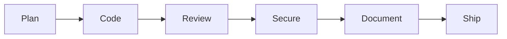

# Marvin

> Claude Code toolkit for those who don't panic.

[](https://github.com/real-case/marvin-toolkit/actions/workflows/validate-plugins.yml)
[](./LICENSE)
[](https://nodejs.org)

Marvin is a [Claude Code](https://docs.anthropic.com/en/docs/claude-code) plugin that
packages the whole development lifecycle as **one plugin, one MCP server, and one slash
prefix** — `/marvin:`. Install it and you get structured, repeatable workflows for
committing, reviewing, securing, documenting, and shipping code, all inside Claude Code.
Under the hood it ships **57 prompts, 12 MCP tools, 10 agents, and 7 interactive widgets**
across seven command groups, built on a TypeScript MCP server that runs on Node.js 20 or
later.

## Three doors, one room

Each workflow is authored once at `plugins/marvin/skills/<command>/SKILL.md`, and three
independent entry points reach the same body:

1. **Chat.** Describe what you want — `commit my changes`, `сделай коммит` — and Claude Code matches the skill by its frontmatter description.
2. **Markdown slash command.** Type the terse form, such as `/commit` or `/sec-scan`.
3. **MCP prompt.** Type the namespaced form, such as `/marvin:commit`, served by the bundled server.

Pick whichever feels right; they all run the same skill. The
[architecture tour](./docs/architecture.md) explains how the three doors resolve, with
diagrams.

## Install

Run these two commands inside Claude Code:

```shell
/plugin marketplace add real-case/marvin-toolkit
/plugin install marvin@marvin-toolkit
```

The plugin registers one MCP server named `marvin`, and its commands appear as
`/marvin:<group>-<command>`. No clone or build step is needed, because the server ships
bundled.

## Documentation

- **[Getting started](./docs/getting-started.md)** — install, confirm it works, and run your first commands.
- **[Usage guide](./docs/usage.md)** — worked walkthroughs for committing, the task pipeline, kanban, security, and refactoring.
- **[Configuration](./docs/configuration.md)** — the `.marvin/` working directory, `.marvin/config.json`, and the `MARVIN_*` environment variables.
- **[Command reference](./docs/commands.md)** — every `/marvin:` command with a synopsis and the phrases that invoke it.
- **[Architecture](./docs/architecture.md)** — how the plugin is built, with diagrams.

## The command groups

Commands follow the pattern `/marvin:<group>-<command>`, and singletons stay bare. The 57
prompts divide into seven groups:

| Group | Purpose | Count |
|-------|---------|-------|
| _(bare)_ | Core developer tools | 13 |
| `adr-*` | ADR lifecycle | 6 |
| `pr-*` | Pull-request operations | 4 |
| `task-*` | Spec-driven task pipeline | 5 |
| `sec-*` | Security scanners | 11 |
| `refactor-*` | Code-health family (read, plan, apply) | 4 |
| `kanban-*` | Lightweight task tracker | 14 |

The tables below give a one-line synopsis per command. The
[command reference](./docs/commands.md) adds the natural-language phrases that invoke each
one from chat.

### Core developer tools

These are language-agnostic and used by every engineer.

| Command | Description |
|---------|-------------|
| `/marvin:commit` | Draft a Conventional Commits message with sensitive-file detection. |
| `/marvin:debug` | Systematic root-cause analysis with hypotheses. |
| `/marvin:adr` | Draft an Architecture Decision Record; drafts land `proposed`. |
| `/marvin:changelog` | Generate a changelog from git history. |
| `/marvin:readme` | Generate or update `README.md` from codebase analysis. |
| `/marvin:migration-plan` | Plan a migration with risks and a rollback strategy. |
| `/marvin:explain` | Explain code, architecture, and execution flow. |
| `/marvin:docs-search` | Search and synthesize the project documentation. |
| `/marvin:handoff` | Capture the session context into `.marvin/handoff/` to continue later. |
| `/marvin:handoff-list` | List the session-continuation handoff documents, newest first. |
| `/marvin:lessons` | Browse the lessons-learned store — search, add, stats, and prune. |
| `/marvin:help` | Show the project dashboard and the full command index. |
| `/marvin:dashboard` | Report the whole-toolbox state at a glance. |

The `marvin-guide`, `marvin-researcher`, and `marvin-debugger` agents support these
commands. The plugin also registers two external MCP servers: `context7` for library docs
and `gitmcp` for GitHub repository docs.

### ADR lifecycle — `adr-*`

These wrap the full decision-record lifecycle around the bare `/marvin:adr` create command
([ADR-0027](./docs/adr/0027-tool-backed-adr-lifecycle.md)). Ratification, rollback, and
project-memory sync are reserved for a person, marked below with 👤.

| Command | Description |
|---------|-------------|
| `/marvin:adr-review` | Deeply review one `proposed` record and return a verdict. |
| `/marvin:adr-accept` 👤 | Ratify `proposed` to `accepted` through the readiness gate. |
| `/marvin:adr-audit` | Lint the corpus read-only, with remediation guidance. |
| `/marvin:adr-coverage` | Analyze gaps between recorded decisions and the actual stack. |
| `/marvin:adr-supersede` 👤 | Roll a decision back through a paired successor record. |
| `/marvin:adr-sync` 👤 | Regenerate the accepted-decisions digest in `CLAUDE.md`. |

### Pull-request lifecycle — `pr-*`

These cover the pull request from open to merge.

| Command | Description |
|---------|-------------|
| `/marvin:pr-create` | Open a PR with a structured description and pre-flight checks. |
| `/marvin:pr-review` | Review a PR and post severity-tagged inline comments. |
| `/marvin:pr-resolve` | Work through unresolved review threads — fix, push, reply, resolve. |
| `/marvin:pr-merge` | Merge a PR, then check out the base branch and pull. |

### Spec-driven task pipeline — `task-*`

These separate the human decisions in a spec from the automated execution that follows.

| Command | Description |
|---------|-------------|
| `/marvin:task-start` | Co-create a spec through a dialogue, then a Definition-of-Ready gate. |
| `/marvin:task-implement` | Execute a ready spec in the current session. |
| `/marvin:task-verify` | Run the quality gates with stack auto-detection. |
| `/marvin:task-deliver` | Commit and open a PR, gated on verification passing. |
| `/marvin:task-summary` | Aggregate a finished task into one delivery summary. |

The `marvin-tm-writer`, `marvin-tm-executor`, `marvin-tm-spec-critic`,
`marvin-tm-diff-critic`, and `marvin-tm-review-fixer` agents support this pipeline.

### Security scanners — `sec-*`

These cover OWASP-aligned scanning, threat modeling, and remediation.

| Command | Description |
|---------|-------------|
| `/marvin:sec-scan` | Run a comprehensive OWASP Top 10:2025 audit. |
| `/marvin:sec-secrets` | Scan for leaked secrets across code, config, and git history. |
| `/marvin:sec-deps` | Audit dependencies for CVEs, license risks, and maintenance health. |
| `/marvin:sec-gate` | Run a fast, diff-scoped pre-commit security check. |
| `/marvin:sec-threat-model` | Build a STRIDE threat model for a feature or system. |
| `/marvin:sec-iac` | Review Infrastructure-as-Code across Terraform, Kubernetes, and Docker. |
| `/marvin:sec-ci` | Audit CI/CD pipelines for supply-chain risks. |
| `/marvin:sec-fix` | Generate and verify a tested patch for a vulnerability. |
| `/marvin:sec-compliance` | Check code against OWASP ASVS at L1, L2, or L3. |
| `/marvin:sec-pentest` | Generate an application-specific penetration-testing checklist. |
| `/marvin:sec-report` | List the structured scanner findings by severity. |

The `marvin-auditor` agent supports these commands.

### Refactoring — `refactor-*`

These form the code-health family ([ADR-0029](./docs/adr/0029-refactoring-command-family.md)),
split by mutation into read, plan, and apply.

| Command | Description |
|---------|-------------|
| `/marvin:refactor-audit` | Run a whole-project structural audit into a findings register. |
| `/marvin:refactor-smells` | Scan a path, module, or diff for smells and anti-patterns. |
| `/marvin:refactor-plan` | Sequence selected findings into small, risk-annotated steps. |
| `/marvin:refactor-apply` | Execute one behavior-preserving step behind the verify gate. |

The `marvin-refactor-auditor` agent supports these commands.

### Kanban tracker — `kanban-*`

These drive a lightweight per-project board with interactive forms
([ADR-0025](./docs/adr/0025-kanban-board-only.md)). New tasks branch off following the
convention `<type-prefix>/<seq>[-<tracker>]--<slug>`, and committing or opening a PR for a
board task goes through the kanban-aware `/marvin:commit` and `/marvin:pr-create`, which
pick up the linked task automatically.

| Command | Description |
|---------|-------------|
| `/marvin:kanban-menu` | Open the main menu. |
| `/marvin:kanban-bug`, `-feature`, `-chore`, `-spike` | Quick-create a task of the given type. |
| `/marvin:kanban-start` | Pick a todo task, branch off, and mark it in progress. |
| `/marvin:kanban-review` | Move the current task to review. |
| `/marvin:kanban-done` | Mark the current task done. |
| `/marvin:kanban-list` | List all tasks grouped by status. |
| `/marvin:kanban-show` | Show one task in full. |
| `/marvin:kanban-tracker` | List tasks with an external tracker id, linking out. |
| `/marvin:kanban-status` | Show the current branch and its work-in-progress tasks. |
| `/marvin:kanban-config` | Show or edit the board configuration. |
| `/marvin:kanban-help` | Show the board dashboard scoped to the kanban commands. |

Statuses are project data ([ADR-0026](./docs/adr/0026-configurable-status-model.md)):
configure your tracker's vocabulary through `/marvin:kanban-config`, and the lifecycle
commands drive it by role. The [configuration reference](./docs/configuration.md) documents
every setting.

## Interactive widgets

On an MCP host that supports the Apps widget layer, seven commands render an interactive
panel in addition to their text output
([ADR-0024](./docs/adr/0024-mcp-apps-widget-architecture.md)). The panel is additive, so a
text-only host shows the same information as text and no command depends on a rich host.
The widget-backed commands are `/marvin:kanban-list`, `/marvin:kanban-show`,
`/marvin:kanban-tracker`, `/marvin:task-summary`, `/marvin:sec-report`,
`/marvin:handoff-list`, and `/marvin:dashboard`.

## Development lifecycle

The core, `pr-*`, and `sec-*` commands map onto the everyday flow from planning a change to
shipping it.



| Phase | Commands |
|-------|----------|
| Plan | `adr`, `migration-plan` |
| Code | `debug`, `explain`, `docs-search`, `refactor-*` |
| Review | `pr-review`, `refactor-smells` |
| Secure | `sec-scan`, `sec-secrets`, `sec-deps`, `sec-gate` |
| Document | `readme`, `changelog` |
| Ship | `commit`, `pr-create`, `pr-resolve`, `pr-merge` |

Layer the `kanban-*` tracker on top of any of these for day-to-day tracking, and run
`/marvin:dashboard` to see the whole toolbox's state at a glance.

## Architecture decisions

Decisions with long-lived consequences are recorded as ADRs under
[docs/adr/](./docs/adr/). The two pre-consolidation ADRs, covering the source format and
the MCP-first stance, were retired in the publication cut, and their still-relevant
rationale is folded into 0001, 0013, and 0018.

| ADR | Decision | Status |
|-----|----------|--------|
| [0001](./docs/adr/0001-single-plugin-consolidation.md) | Single-plugin consolidation under one `/marvin:` prefix | Accepted |
| [0002](./docs/adr/0002-tool-backed-verification.md) | Tool-backed verification gate | Accepted |
| [0003](./docs/adr/0003-tool-backed-dor.md) | Tool-backed Definition-of-Ready gate | Accepted |
| [0004](./docs/adr/0004-traceable-spec-contract.md) | Traceable spec contract and gate reordering | Accepted |
| [0005](./docs/adr/0005-portable-spec-contract.md) | Portable, host-adaptive spec contract | Accepted |
| [0006](./docs/adr/0006-all-subagents-opus.md) | All subagents on Opus; economy via deterministic tools | Accepted |
| [0007](./docs/adr/0007-marvin-working-directory.md) | Unified `.marvin/` working directory | Accepted |
| [0008](./docs/adr/0008-mcp-door-resource-resolution.md) | MCP-door plugin-resource resolution | Accepted |
| [0009](./docs/adr/0009-config-first-gate-resolution.md) | Config-first gate resolution for `verify` | Accepted |
| [0010](./docs/adr/0010-tool-backed-contract-seal.md) | Tool-backed contract-seal verification | Accepted |
| [0011](./docs/adr/0011-tool-backed-scope-gate.md) | Tool-backed scope-allowlist gate | Accepted |
| [0012](./docs/adr/0012-tool-backed-delivery-gate.md) | Tool-backed delivery gate | Accepted |
| [0013](./docs/adr/0013-self-contained-server-bundle.md) | Self-contained committed server bundle | Accepted |
| [0014](./docs/adr/0014-distribution-release-model.md) | Distribution and release model (git tag to GitHub Release; no npm) | Accepted |
| [0015](./docs/adr/0015-verify-shell-trust-boundary.md) | `verify` shell-execution trust boundary | Accepted |
| [0016](./docs/adr/0016-bundled-external-mcp-deps.md) | Bundled external MCP dependencies (context7, gitmcp) | Accepted |
| [0017](./docs/adr/0017-adversarial-critic-gates.md) | Adversarial critic gates in the task pipeline | Accepted |
| [0018](./docs/adr/0018-three-doors-instrument-taxonomy.md) | Three doors and the instrument taxonomy | Accepted |
| [0019](./docs/adr/0019-branching-and-pr-flow.md) | Branching model: release `main`, integration `dev`, changes via PRs | Accepted |
| [0020](./docs/adr/0020-debugger-agent.md) | Root-cause analysis as the `marvin-debugger` agent | Accepted |
| [0021](./docs/adr/0021-lessons-feedback-loop.md) | Tool-backed lessons-learned feedback loop | Accepted |
| [0022](./docs/adr/0022-numbered-spec-files.md) | Numeric-prefixed spec filenames | Accepted |
| [0023](./docs/adr/0023-pr-command-family.md) | Unified `pr-*` pull-request command family | Accepted |
| [0024](./docs/adr/0024-mcp-apps-widget-architecture.md) | MCP Apps widget layer: data-first staging and shared data contracts | Accepted |
| [0025](./docs/adr/0025-kanban-board-only.md) | Kanban goes board-only; git ops fold into the `commit` and `pr-create` skills | Accepted |
| [0026](./docs/adr/0026-configurable-status-model.md) | Configurable status model: statuses are project data, roles stay closed | Accepted |
| [0027](./docs/adr/0027-tool-backed-adr-lifecycle.md) | Tool-backed ADR lifecycle | Accepted |
| [0028](./docs/adr/0028-lessons-hygiene-and-recall-expansion.md) | Lessons v2: hygiene surface and recall or capture expansion | Accepted |
| [0029](./docs/adr/0029-refactoring-command-family.md) | Refactoring command family: read, plan, apply under hard rails | Accepted |
| [0030](./docs/adr/0030-toolbox-dashboard-and-usage-log.md) | Toolbox dashboard and local usage log | Accepted |

## Contributing

Contributions are welcome. Every change must pass the same quality gates CI runs:

```shell
npm run lint              # ESLint over the TypeScript source
npm run format:check      # Prettier
npm run lint:manifests    # marketplace and plugin manifest structure
npm run lint:docs         # ADR coverage and working-directory paths
npm run build             # build every workspace
npm run test              # Node.js native test suites
npm run verify-dist       # committed dist/ matches a fresh build
```

See [CONTRIBUTING.md](./CONTRIBUTING.md) for the full setup and workflow, and
[CLAUDE.md](./CLAUDE.md) for the architecture reference.

## Security

If you find a vulnerability, please report it privately, as described in
[SECURITY.md](./SECURITY.md).

## License

[MIT](./LICENSE) © Yurii Anichkin
