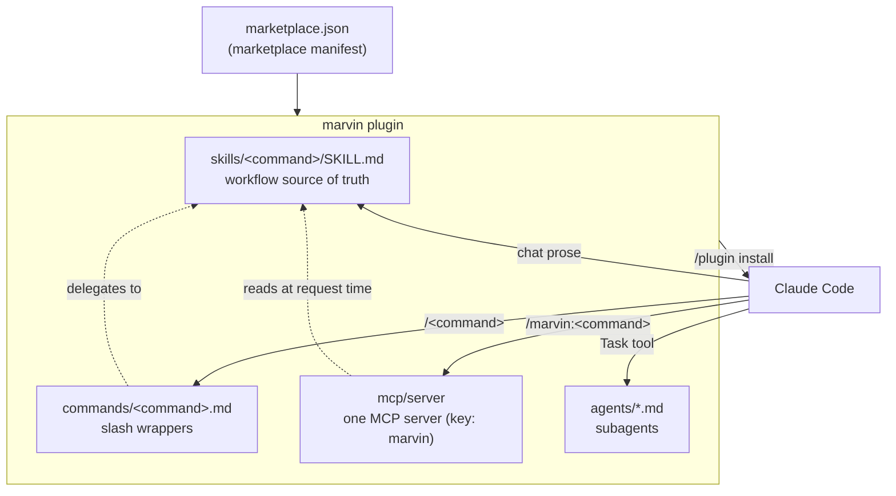
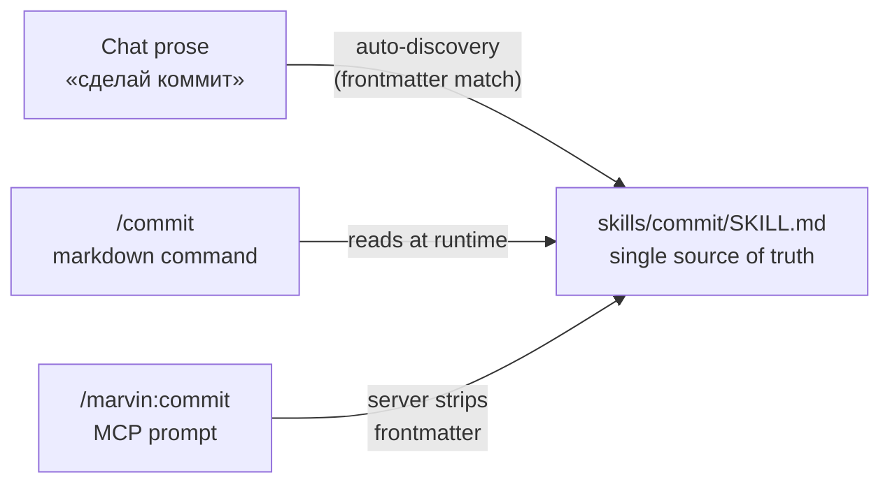
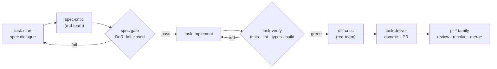

# Marvin — Architecture

This is the human-facing tour of how Marvin is built. For the decision history,
see the [ADRs](./adr/); for the contributor-facing recipes (adding a prompt, a
tool, an agent), see [CLAUDE.md](../CLAUDE.md).

Marvin is a Claude Code **plugin marketplace** shipping **one plugin** (`marvin`)
backed by **one MCP server**, under a single slash prefix `/marvin:`. It covers the
whole development lifecycle: core dev tools, the ADR decision-record lifecycle, a
spec-driven task pipeline, security scanners, a code-health refactoring family, and a
lightweight kanban tracker — **54 prompts, 9 tools, 10 agents** across seven command
groups.

## System at a glance

A single `/plugin install` registers the MCP server and auto-discovers the skills,
commands, and agents. Everything a user invokes — by chat, by `/command`, or by
`/marvin:command` — ultimately resolves to the same skill prose.

## Command groups

Commands are `/marvin:<group>-<command>`; singletons stay bare. The **54** prompts
divide into seven groups (see the [command reference](./commands.md) for every entry):

| Group | What | Count |
|-------|------|-------|
| _(bare)_ | core developer tools | 13 |
| `adr-*` | ADR lifecycle (accept/supersede/sync human-run) | 6 |
| `pr-*` | pull-request operations | 4 |
| `task-*` | spec-driven task pipeline | 5 |
| `sec-*` | security scanners | 10 |
| `refactor-*` | code-health family (read → plan → apply) | 4 |
| `kanban-*` | lightweight task tracker | 12 |

Behind the prompts sit **9 deterministic MCP tools** (`task`, `help`, `dashboard`,
`verify`, `spec`, `lessons`, `adr`, `handoff`, `summary`) and **10 subagents**.

## Three doors, one room

The defining design choice (recorded in [ADR-0001](./adr/0001-single-plugin-consolidation.md)):
each workflow is authored **once** in a `SKILL.md`, and three independent entry
points reach it. Editing the skill updates all three without a server rebuild.

| Door | Surface | How it resolves the skill |
|------|---------|---------------------------|
| Auto-discovery | chat prose | Claude Code matches the skill's frontmatter `description` |
| Markdown command | `/commit` | `commands/commit.md` instructs the model to read the skill |
| MCP prompt | `/marvin:commit` | the server reads the skill, strips frontmatter, returns the body |

> The `kanban-*` group is the deliberate exception: its 12 prompts are thin
> tool-invocation wrappers with an inline `body:` — no `SKILL.md`, no markdown
> command. There is no workflow prose to share, so only the MCP door exists.

## Instrument types

| Instrument | Lives in | Role |
|------------|----------|------|
| **Skill** | `skills/<command>/SKILL.md` | Source-of-truth workflow prose (Markdown + frontmatter) |
| **Markdown command** | `commands/<command>.md` | Thin `/<command>` wrapper delegating to the skill |
| **MCP prompt** | `mcp/server/src/prompts/index.ts` | Registers `/marvin:<command>` (skill-backed or inline `body:`) |
| **MCP tool** | `mcp/server/src/tools/*.ts` | Deterministic TypeScript with a zod schema — used where determinism matters |
| **Agent** | `agents/*.md` | Claude Code subagent with constrained tool access |

The split between **prose** (skills) and **tools** (TypeScript) is intentional:
narrative judgement lives in skills; anything that must be deterministic — file
CRUD, the verification gate, the Definition-of-Ready gate — is a tool.

## The task pipeline

The `task-*` group separates **human decisions** (what to build, captured as an
immutable spec) from **automated execution**. Two tool-backed gates and two
red-team critics guard the flow.

After delivery the PR is handled by the `pr-*` command family — `pr-review` posts a
GitHub review, `pr-resolve` turns the unresolved threads into fixes, and `pr-merge`
lands it (`marvin-tm-review-fixer` is the autonomous twin of `pr-resolve`).

- The **spec gate** ([ADR-0003](./adr/0003-tool-backed-dor.md)) zod-validates the
  spec's `spec-contract` block fail-closed — schema, file-path existence, and the
  acceptance-criteria ⇄ files ⇄ tests traceability triple.
- The **verify gate** ([ADR-0002](./adr/0002-tool-backed-verification.md)) runs
  quality gates concurrently with stack auto-detection and writes `verification.md`,
  which `task-deliver` refuses to bypass.

## Development lifecycle

The core, `pr-*`, and `sec-*` commands map onto the everyday flow:

| Phase | Commands |
|-------|----------|
| Plan | `adr` (+ the `adr-*` lifecycle), `migration-plan` |
| Code | `debug`, `explain`, `docs-search`, `refactor-*` (audit → plan → apply) |
| Review | `pr-review`, `refactor-smells` |
| Secure | `sec-scan`, `sec-secrets`, `sec-deps`, `sec-gate`, … |
| Document | `readme`, `changelog` |
| Ship | `commit`, `pr-create`, `pr-resolve`, `pr-merge` |

Layer the `kanban-*` tracker on top of any of these for day-to-day task tracking, and
`/marvin:dashboard` to see the whole toolbox's state at a glance.

## Working directory (`.marvin/`)

Every **service file** Marvin generates lives under one hidden `.marvin/` directory
at the project root, one subdirectory per command group
([ADR-0007](./adr/0007-marvin-working-directory.md)):

| Path | Written by | Contents |
|------|-----------|----------|
| `.marvin/task/` | `task-*` | spec files + the current `verification.md` |
| `.marvin/security/` | `sec-*` | scan / threat-model / compliance / pentest reports |
| `.marvin/refactor/` | `refactor-*` | numbered findings-register reports (audit / smells) + step plans (ADR-0029) |
| `.marvin/kanban/` | `kanban-*` | the task `.md` board |
| `.marvin/memory/` | `lessons` | team-shared lessons-learned (`MEMORY.md` + lesson files) |
| `.marvin/handoff/` | `handoff` | session-continuation handoff docs |
| `.marvin/usage/` | usage-log middleware | local, never-committed usage events (`events.jsonl`) read by `/marvin:dashboard` |
| `.marvin/config.json` | `kanban-*` | `base_branch`, `tracker_url_template`, `usage.enabled` kill-switch |

Project **deliverables** are deliberately not swept in: ADRs stay under `docs/adr/`,
and `CHANGELOG.md` / `README.md` at the root.

### Usage telemetry and privacy

marvin records a small, **strictly local** usage signal so `/marvin:dashboard` can
answer "which commands does this project actually use?"
([ADR-0030](./adr/0030-toolbox-dashboard-and-usage-log.md)). A `runPackServer`
middleware hook appends one JSON line per prompt-get and per tool-call to
`.marvin/usage/events.jsonl`:

- **What is recorded:** the timestamp, whether it was a `prompt` or a `tool`, and the
  command name — nothing else. No arguments, no file contents, no PII.
- **Where it lives:** only in the project-local `.marvin/usage/` directory. The
  directory self-ignores (a `.gitignore` of `*` is written on first use), so the log
  never reaches git, and it is never transmitted anywhere — the sole reader is the
  local dashboard. The file is size-capped and rotates so it cannot grow unbounded.
- **How to disable:** set `usage: { enabled: false }` in `.marvin/config.json` (via
  `/marvin:kanban-config` or by hand). Telemetry is opt-out; logging is also
  fail-open — any logger error is swallowed and never affects the command being run.

## Where to go next

- [Architecture Decision Records](./adr/) — the full decision history.
- [CONTRIBUTING.md](../CONTRIBUTING.md) — setup, quality gates, how to submit a change.
- [CLAUDE.md](../CLAUDE.md) — the deep contributor reference and step-by-step recipes.
