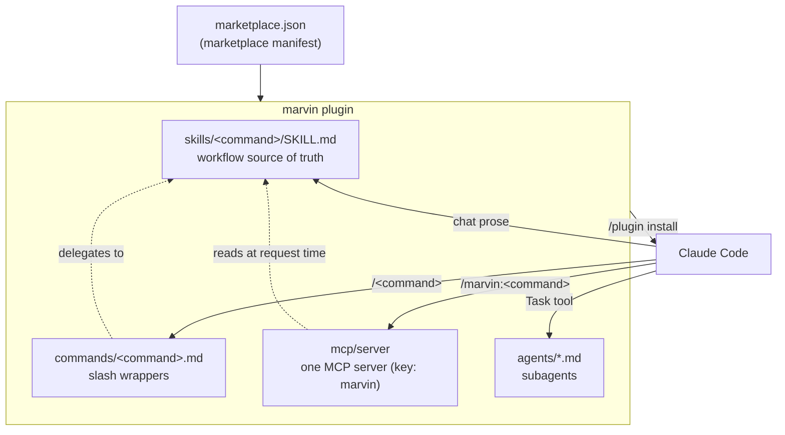
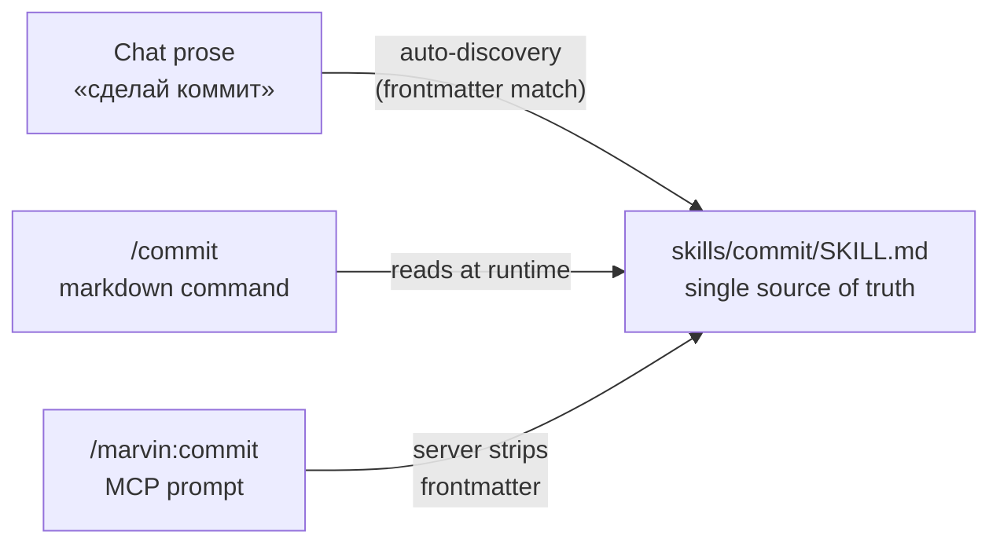
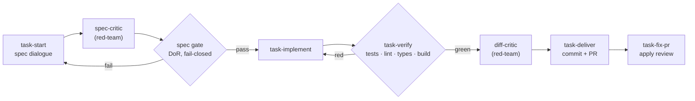

# Marvin — Architecture

This is the human-facing tour of how Marvin is built. For the decision history,
see the [ADRs](./adr/); for the contributor-facing recipes (adding a prompt, a
tool, an agent), see [CLAUDE.md](../CLAUDE.md).

Marvin is a Claude Code **plugin marketplace** shipping **one plugin** (`marvin`)
backed by **one MCP server**, under a single slash prefix `/marvin:`. It covers the
whole development lifecycle: core dev tools, a spec-driven task pipeline, security
scanners, and a lightweight kanban tracker.

## System at a glance

A single `/plugin install` registers the MCP server and auto-discovers the skills,
commands, and agents. Everything a user invokes — by chat, by `/command`, or by
`/marvin:command` — ultimately resolves to the same skill prose.

## Three doors, one room

The defining design choice (recorded in [ADR-0003](./adr/0003-single-plugin-consolidation.md)):
each workflow is authored **once** in a `SKILL.md`, and three independent entry
points reach it. Editing the skill updates all three without a server rebuild.

| Door | Surface | How it resolves the skill |
|------|---------|---------------------------|
| Auto-discovery | chat prose | Claude Code matches the skill's frontmatter `description` |
| Markdown command | `/commit` | `commands/commit.md` instructs the model to read the skill |
| MCP prompt | `/marvin:commit` | the server reads the skill, strips frontmatter, returns the body |

> The `kanban-*` group is the deliberate exception: its 13 prompts are thin
> tool-invocation wrappers with an inline `body:` — no `SKILL.md`, no markdown
> command. There is no workflow prose to share, so only the MCP door exists.

## Instrument types

| Instrument | Lives in | Role |
|------------|----------|------|
| **Skill** | `skills/<command>/SKILL.md` | Source-of-truth workflow prose (Markdown + frontmatter) |
| **Markdown command** | `commands/<command>.md` | Thin `/<command>` wrapper delegating to the skill |
| **MCP prompt** | `mcp/server/src/prompts/index.ts` | Registers `/marvin:<command>` (skill-backed or inline `body:`) |
| **MCP tool** | `mcp/server/src/tools/*.ts` | Deterministic TypeScript with a zod schema — used where determinism matters |
| **Agent** | `agents/*.md` | Claude Code subagent with constrained tool access |

The split between **prose** (skills) and **tools** (TypeScript) is intentional:
narrative judgement lives in skills; anything that must be deterministic — file
CRUD, the verification gate, the Definition-of-Ready gate — is a tool.

## The task pipeline

The `task-*` group separates **human decisions** (what to build, captured as an
immutable spec) from **automated execution**. Two tool-backed gates and two
red-team critics guard the flow.

- The **spec gate** ([ADR-0005](./adr/0005-tool-backed-dor.md)) zod-validates the
  spec's `spec-contract` block fail-closed — schema, file-path existence, and the
  acceptance-criteria ⇄ files ⇄ tests traceability triple.
- The **verify gate** ([ADR-0004](./adr/0004-tool-backed-verification.md)) runs
  quality gates concurrently with stack auto-detection and writes `verification.md`,
  which `task-deliver` refuses to bypass.

## Development lifecycle

The core, `pr-*`, and `sec-*` commands map onto the everyday flow:

| Phase | Commands |
|-------|----------|
| Plan | `adr`, `migration-plan` |
| Code | `debug`, `explain`, `docs-search` |
| Review | `pr-review` |
| Secure | `sec-scan`, `sec-secrets`, `sec-deps`, `sec-gate`, … |
| Document | `readme`, `changelog` |
| Ship | `commit`, `pr-create` |

Layer the `kanban-*` tracker on top of any of these for day-to-day task tracking.

## Working directory (`.marvin/`)

Every **service file** Marvin generates lives under one hidden `.marvin/` directory
at the project root, one subdirectory per command group
([ADR-0009](./adr/0009-marvin-working-directory.md)):

| Path | Written by | Contents |
|------|-----------|----------|
| `.marvin/task/` | `task-*` | spec files + the current `verification.md` |
| `.marvin/security/` | `sec-*` | scan / threat-model / compliance / pentest reports |
| `.marvin/kanban/` | `kanban-*` | the task `.md` board |
| `.marvin/config.json` | `kanban-*` | `base_branch`, `tracker_url_template` |

Project **deliverables** are deliberately not swept in: ADRs stay under `docs/adr/`,
and `CHANGELOG.md` / `README.md` at the root.

## Where to go next

- [Architecture Decision Records](./adr/) — the full decision history.
- [CONTRIBUTING.md](../CONTRIBUTING.md) — setup, quality gates, how to submit a change.
- [CLAUDE.md](../CLAUDE.md) — the deep contributor reference and step-by-step recipes.
