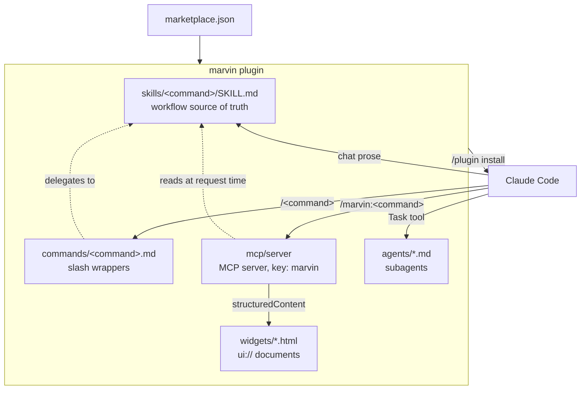
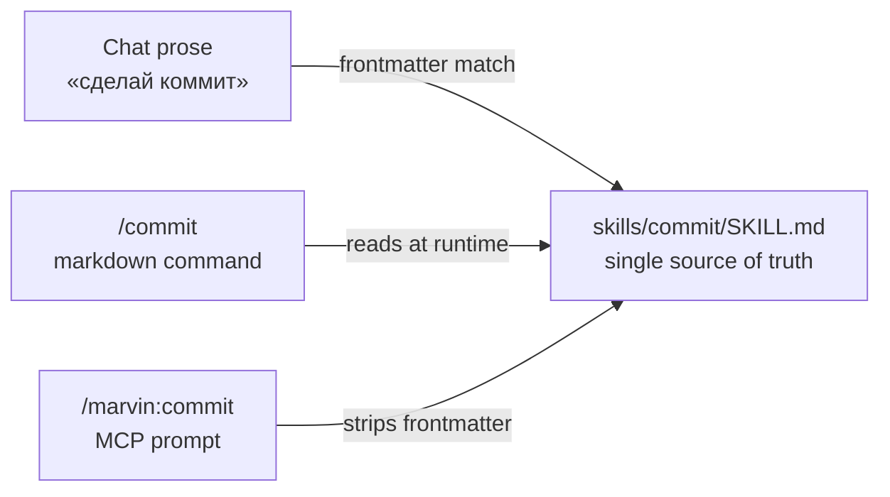
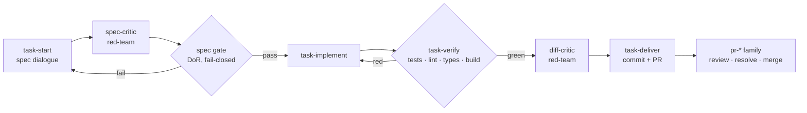
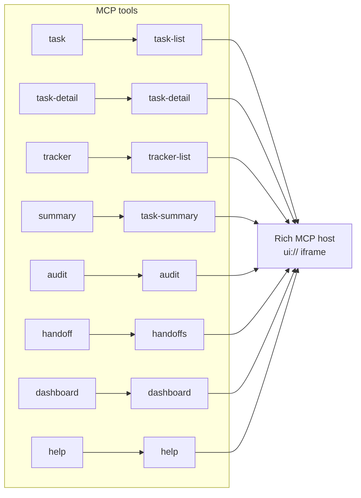

# Architecture

Marvin is a Claude Code plugin that packages the whole development lifecycle as
**one plugin, one MCP server, and one slash prefix** — `/marvin:`. It covers core
developer tools, an Architecture Decision Record lifecycle, a spec-driven task
pipeline, security scanners, a code-health refactoring family, and a lightweight
task tracker, and it ships **51 prompts, 13 MCP tools, 10 agents, and 9 interactive
widgets** across seven command groups.

This page is the conceptual tour of how those pieces fit together and why the project
is built the way it is. For the decision history behind each choice, read the
[Architecture Decision Records](./adr/); for the contributor recipes that add a prompt,
a tool, or an agent, read [CLAUDE.md](../CLAUDE.md).

## The primary stack

Everything Marvin ships is built from five kinds of file, all auto-loaded by Claude
Code on `/plugin install`:

- **Skills** are Markdown workflow documents under `skills/<command>/SKILL.md`. They are the source of truth for what each command does.
- **Markdown commands** under `commands/<command>.md` are thin `/<command>` wrappers that delegate to a skill.
- **MCP prompts** are registered by the bundled server and surface each workflow as `/marvin:<command>`.
- **MCP tools** are deterministic TypeScript, each with a zod input schema, used wherever an operation must be exact rather than narrative.
- **Agents** under `agents/*.md` are Claude Code subagents with constrained tool access.

The server itself is a TypeScript MCP server that targets Node.js 20 or later. It is
bundled with `tsup` into a single self-contained `dist/server.js` that is committed to
the repository, so installation never runs a build step. The nine widgets are a
separate browser workspace built to committed, self-contained HTML.

## System at a glance

A single `/plugin install` registers the MCP server and auto-discovers the skills,
commands, and agents. Whatever a user invokes — by chat, by a `/<command>`, or by a
`/marvin:<command>` — ultimately resolves to the same skill prose or the same tool.

## Command groups

Commands follow the pattern `/marvin:<group>-<command>`, and singletons stay bare. The
51 prompts divide into seven groups. The [command reference](./commands.md) lists every
entry with a synopsis and the phrases that invoke it from chat.

| Group | Purpose | Count |
|-------|---------|-------|
| _(bare)_ | Core developer tools | 14 |
| `adr-*` | ADR lifecycle | 6 |
| `pr-*` | Pull-request operations | 4 |
| `task-*` | Spec-driven task pipeline | 5 |
| `sec-*` | Security scanners | 11 |
| `refactor-*` | Code-health family (read, plan, apply) | 4 |
| `track-*` | Lightweight task tracker | 7 |

The `task-*` pipeline and the `track-*` tracker are deliberately separate domains. Reach
for `task-*` when a change is large enough to deserve a written spec, and for `track-*`
when you want fast day-to-day tracking.

## Call it your way

The defining design choice, recorded in [ADR-0001](./adr/0001-single-plugin-consolidation.md),
is that each workflow is authored **once** in a `SKILL.md`, and three independent entry
points reach it. Editing the skill updates all three entry points at once, with no server
rebuild, because two of them read the file at request time and the third rediscovers it
on the next match.

Each door resolves the skill a different way, but the reader ends up in the same room.

| Door | Surface | How it resolves the skill |
|------|---------|---------------------------|
| Auto-discovery | Chat prose | Claude Code matches the skill's frontmatter `description`. |
| Markdown command | `/commit` | `commands/commit.md` instructs the model to read the skill. |
| MCP prompt | `/marvin:commit` | The server reads the skill, strips its frontmatter, and returns the body. |

The `track-*` group is the deliberate exception. Its 7 prompts (ADR-0032) are thin
tool-invocation wrappers that carry an inline body rather than pointing at a skill, so
only the MCP door exists for them. There is no separate workflow prose to share, because
the work is done by the underlying tools.

## Instrument types

The building blocks split cleanly by role, and the split between prose and code is the
point rather than an accident.

| Instrument | Lives in | Role |
|------------|----------|------|
| Skill | `skills/<command>/SKILL.md` | Source-of-truth workflow prose in Markdown with frontmatter. |
| Markdown command | `commands/<command>.md` | Thin `/<command>` wrapper that delegates to the skill. |
| MCP prompt | `mcp/server/src/prompts/index.ts` | Registers `/marvin:<command>`, either skill-backed or with an inline body. |
| MCP tool | `mcp/server/src/tools/*.ts` | Deterministic TypeScript with a zod schema, used where exactness matters. |
| Agent | `agents/*.md` | A Claude Code subagent with constrained tool access. |
| Widget | `widgets/*.html` | A sandboxed `ui://` document a tool binds for rich hosts. |

Narrative judgement lives in skills, while anything that must be deterministic lives in a
tool. File CRUD on the board, the verification gate, and the Definition-of-Ready gate are
all tools precisely because their behavior must not vary with phrasing.

## Deterministic tools

Twelve MCP tools sit behind the prompts, each declaring a zod input schema. They group by
the job they do.

| Tool | Group | Role |
|------|-------|------|
| `task` | Task board | Task CRUD, role-driven transitions, PR-URL capture, archive, and board configuration. |
| `task-detail` | Task board | A single task's fields and body, for the detail widget. |
| `tracker` | Task board | Read-only list of tasks that carry an external tracker id. |
| `help` | Toolbox state | The project dashboard and the registry-derived command index. |
| `dashboard` | Toolbox state | The whole-toolbox status report. |
| `verify` | Task pipeline | The concurrent quality-gate runner that writes `verification.md`. |
| `spec` | Task pipeline | The Definition-of-Ready gate that validates a spec contract. |
| `summary` | Read-side | A finished task's delivery digest. |
| `handoff` | Read-side | The session-continuation handoff documents. |
| `audit` | Read-side | The structured findings the `sec-*` scanners wrote. |
| `lessons` | Read-side | The team lessons-learned store. |
| `adr` | Decision lifecycle | ADR numbering, corpus parsing, the accept gate, and the managed index. |

## Agents

Ten subagents handle work that benefits from a fresh context or a constrained toolset.
The read-only and read-mostly agents pin their access with a `tools:` allowlist, which is
what actually enforces their contract, because a subagent that omits `tools:` inherits
every tool.

| Agent | Role |
|-------|------|
| `marvin-guide` | Onboarding and codebase navigation, read-only. |
| `marvin-researcher` | Version-specific documentation lookup. |
| `marvin-debugger` | Root-cause analysis, read-mostly. |
| `marvin-auditor` | Security review, read-only. |
| `marvin-refactor-auditor` | Structural audit and smell verification for the `refactor-*` family, read-only. |
| `marvin-tm-writer` | Conversational spec exploration. |
| `marvin-tm-spec-critic` | Red-team review of a drafted spec, read-only. |
| `marvin-tm-executor` | Headless spec execution in a worktree. |
| `marvin-tm-diff-critic` | Red-team review of a branch or staged diff, read-only. |
| `marvin-tm-review-fixer` | Autonomous resolution of PR review comments. |

## The task pipeline

The `task-*` group separates the decisions a human should make, captured as an immutable
spec, from the execution that follows. Two tool-backed gates and two red-team critics
guard the flow, so a spec cannot advance until it is ready and code cannot ship until it
verifies.

The two gates are the load-bearing parts of the pipeline:

- The **spec gate** ([ADR-0003](./adr/0003-tool-backed-dor.md)) validates the spec's contract block fail-closed, checking the schema, that every referenced file path exists, and that the acceptance criteria trace to their files and tests.
- The **verify gate** ([ADR-0002](./adr/0002-tool-backed-verification.md)) runs the quality gates concurrently with stack auto-detection and writes `verification.md`, which `task-deliver` refuses to bypass.

Once a change is delivered, the `pr-*` family takes over. `pr-review` posts a GitHub
review, `pr-resolve` turns the unresolved threads into fixes, and `pr-merge` lands the
change. The `marvin-tm-review-fixer` agent is the autonomous twin of `pr-resolve`.

## The MCP Apps widget layer

Rich MCP hosts can render a tool's structured output in a sandboxed `ui://` iframe, and
Marvin ships eight such widgets ([ADR-0024](./adr/0024-mcp-apps-widget-architecture.md)).
Eight of the twelve tools bind a widget, so on a capable host the same command that prints
a text report also renders an interactive panel.

Three properties keep this layer from leaking complexity into the rest of the project:

- **The terminal fallback is always intact.** The widget binding is additive metadata, so a text-only host ignores it and renders the tool's text content exactly as before. No command depends on a rich host.
- **The server stays free of any browser SDK.** The widgets live in `packages/marvin-widgets/` and build to committed HTML; the server only registers the `ui://` documents and loads each file at request time, so `dist/server.js` never bundles React or the widget toolkit.
- **Widgets share two primitives.** A master-detail `<ListDetail>` and a dependency-free `<Markdown>` renderer back every widget, over a small set of shared data contracts that the tools already emit.

## Development lifecycle

The core, `pr-*`, and `sec-*` commands map onto the everyday flow from planning a change
to shipping it.

| Phase | Commands |
|-------|----------|
| Plan | `adr` and the `adr-*` lifecycle, `migration-plan` |
| Code | `debug`, `explain`, `docs-search`, `refactor-*` |
| Review | `pr-review`, `refactor-smells` |
| Secure | `sec-scan`, `sec-secrets`, `sec-deps`, `sec-gate`, and the rest of `sec-*` |
| Document | `readme`, `changelog` |
| Ship | `commit`, `pr-create`, `pr-resolve`, `pr-merge` |

Layer the `track-*` tracker on top of any of these for day-to-day task tracking, and run
`/marvin:dashboard` to see the whole toolbox's state at a glance.

## The working directory

Every service file Marvin generates lives under one hidden `.marvin/` directory at the
project root, with one subdirectory per command group
([ADR-0007](./adr/0007-marvin-working-directory.md)). This keeps Marvin's artifacts
together and easy to include in or exclude from version control.

| Path | Written by | Contents |
|------|-----------|----------|
| `.marvin/task/` | `task-*` | Immutable specs and the current `verification.md`. |
| `.marvin/security/` | `sec-*` | Scan, threat-model, compliance, and pentest reports. |
| `.marvin/refactor/` | `refactor-*` | Numbered findings registers and sequenced step plans. |
| `.marvin/track/` | `track-*` | The task board as markdown files. |
| `.marvin/memory/` | `lessons` | The team lessons-learned store and its index. |
| `.marvin/handoff/` | `handoff` | Session-continuation documents. |
| `.marvin/usage/` | The usage-log middleware | A local, never-committed telemetry log. |
| `.marvin/config.json` | `track-*` and `verify` | The project settings documented in the [configuration reference](./configuration.md). |

Project deliverables are deliberately left out of this sweep. Architecture Decision
Records stay under `docs/adr/`, and `CHANGELOG.md` and `README.md` stay at the root.

### Usage telemetry and privacy

Marvin records a small, strictly local usage signal so `/marvin:dashboard` can answer
which commands a project actually uses
([ADR-0030](./adr/0030-toolbox-dashboard-and-usage-log.md)). A server middleware hook
appends one JSON line per prompt invocation and per tool call to `.marvin/usage/events.jsonl`.

- **What it records** is the timestamp, whether the event was a prompt or a tool, and the command name. It never records arguments, file contents, or personal data.
- **Where it lives** is only the project-local `.marvin/usage/` directory. That directory writes its own `.gitignore` of `*` on first use, so the log never reaches git and is never transmitted anywhere, and the file is size-capped with rotation so it cannot grow without bound.
- **How to turn it off** is a single setting: set `usage.enabled` to `false` in `.marvin/config.json`. Telemetry is opt-out, and recording is fail-open, so any logging error is swallowed rather than affecting the command you ran.

## External MCP servers

Alongside its own server, the plugin registers two external MCP servers in `.mcp.json`,
both backing the research workflows and neither required for the core commands. The first
is `context7`, which looks up current library documentation and runs through `npx`. The
second is `gitmcp`, a remote service for GitHub repository documentation.

## Where to go next

- The [Architecture Decision Records](./adr/) hold the full decision history behind everything above.
- [CONTRIBUTING.md](../CONTRIBUTING.md) covers local setup, the quality gates, and how to submit a change.
- [CLAUDE.md](../CLAUDE.md) is the deep contributor reference with step-by-step recipes for adding prompts, tools, and agents.
