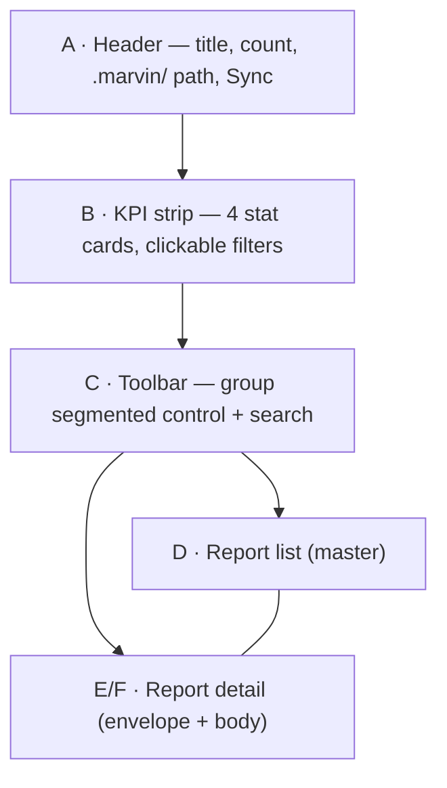

# Reports widget — design specification

**Status:** approved 2026-07-16 · **Owner:** Yurii Anichkin · **Living mockup:** [interactive artifact](https://claude.ai/code/artifact/f0fab56d-2ffb-4b73-8ccc-b152134acbe9) (version `kpi-active-search-h-list-border`)

This document fixes the approved visual and interaction design for the `reports` MCP Apps widget — a single viewer for every document marvin generates under `.marvin/`. It is the input for the implementation task; the interactive artifact above is the pixel reference, and this text is the contract. Where the two disagree, the artifact wins for pixels and this document wins for behavior.

## Overview

The reports widget replaces per-family report browsing with one master–detail surface. Every generated document — security reports, refactor registers and plans, task specs, `verification.md`, handoffs — arrives in the same envelope and renders through one of three body kinds:

- `findings` — severity-ranked, expandable finding rows (all `sec-*` reports, refactor audit and smells registers);
- `checks` — pass/fail/pending rows with notes (verification gates, refactor plan steps);
- `document` — rendered Markdown (task specs, handoff documents).

The widget follows ADR-0024 mechanics (committed self-contained HTML, `ui://` resource, `structuredContent` binding, text-only fallback untouched) but deliberately departs from the current mono/terminal family style. The approved direction is a premium, flat, Radix/Vercel-grade language; how the rest of the family migrates is tracked in [Open questions](#open-questions).

## Design principles

1. Depth without shadows. Elevation is expressed only by surface steps (`--srf` vs `--srf2`) and border strength (`--bd` vs `--bd2`). `box-shadow` is not used anywhere; the selection rail is an inset border technique, not a shadow.
2. Sharp geometry. Every rectangular surface uses `border-radius: 4px` — the widget frame, cards, finding rows, buttons, segmented controls, code chips, badges. Only severity dots stay circular. There are no pill shapes.
3. Color is meaning. Neutral grays carry all hierarchy; hue appears only as severity/status semantics or as the single violet accent. Violet never fills large surfaces.
4. Two first-class themes. Light and dark are separate palettes over the same token names — dark tints are alpha washes over dark surfaces, not inverted light values. The widget defaults to the host theme.
5. Honest coverage. Any truncated list says so explicitly ("+ N more in the report file"); staleness is surfaced rather than hidden.

## Design tokens

Tokens are CSS custom properties scoped to the widget root; the dark set is applied by a `data-t="dark"` attribute (host-driven, mirroring `prefers-color-scheme`).

| Token | Light | Dark | Role |
|---|---|---|---|
| `--bg` | `#fbfbfc` | `#0b0b0d` | widget canvas |
| `--srf` | `#ffffff` | `#141417` | cards, surfaces |
| `--srf2` | `#f4f4f5` | `#1d1d22` | second step: segmented track, code chips, hover, press |
| `--bd` | `#e9e9ec` | `#26262c` | hairline borders (0.5px) |
| `--bd2` | `#d9d9de` | `#3a3a42` | border on hover |
| `--t1` | `#18181b` | `#f4f4f5` | primary text |
| `--t2` | `#52525b` | `#a1a1aa` | secondary text |
| `--t3` | `#a1a1aa` | `#70707a` | meta text, microlabels |
| `--ac` | `#8b5cf6` | `#a78bfa` | accent: selection rail, active filters, engaged KPI border |
| `--act` | `#6d28d9` | `#c4b5fd` | accent text on tint |
| `--acbg` | `rgba(139,92,246,.09)` | `rgba(167,139,250,.13)` | accent tint |
| `--acfill` | `#7c3aed` | `#7c3aed` | filled CTA, text `#fff` |
| `--red` / `--redbg` | `#dc2626` / `#fef2f2` | `#f87171` / `rgba(248,113,113,.11)` | critical, fail |
| `--org` / `--orgbg` | `#c2410c` / `#fff7ed` | `#fb923c` / `rgba(251,146,60,.11)` | high |
| `--amb` / `--ambbg` | `#b45309` / `#fffbeb` | `#fbbf24` / `rgba(251,191,36,.10)` | medium, stale |
| `--grn` / `--grnbg` | `#15803d` / `#f0fdf4` | `#4ade80` / `rgba(74,222,128,.10)` | pass, clean |
| `--blu` / `--blubg` | `#1d4ed8` / `#eff6ff` | `#60a5fa` / `rgba(96,165,250,.11)` | low |
| `--barR/O/A/B` | `#ef4444` `#f97316` `#f59e0b` `#3b82f6` | same | mid-ramp fills for the severity spark bar and mini-charts |

Text-grade severity colors (`--red`, `--org`, …) are for badge text and small glyphs; solid fills in visualizations use the brighter `--bar*` mid-ramp so bars do not read muddy.

## Typography

The widget ships with the system sans stack (`-apple-system, BlinkMacSystemFont, "Segoe UI", Roboto, "Helvetica Neue", Arial`) at a 13px/1.5 base with `letter-spacing: -0.006em`. Only weights 400 and 500 are used. Numbers that align in columns take `font-variant-numeric: tabular-nums`. The scale is:

- widget title 16px/500, tracking −0.015em; detail title 14.5px/500, tracking −0.01em;
- KPI value 21px/500, tracking −0.02em;
- body and row titles 13px (titles at 500), meta 11.5–12px in `--t3`;
- microlabels (section headings, KPI labels) 10.5px, 500, uppercase, tracking +0.06em;
- code (paths, `file:line`, evidence, command chips) in `ui-monospace, SFMono-Regular, Menlo, Consolas` at 11px on `--srf2` chips.

Color transitions are 150ms ease on background, border, and text, and are disabled under `prefers-reduced-motion`.

## Layout and components

The widget is one bordered canvas (`--bg`, 0.5px `--bd`, radius 4px, 14px padding) with four stacked zones, then the split view. The zone letters below match the markers in the review artifact.



### A — Header

The title row carries the widget name, a neutral count badge, and the `.marvin/` path with a one-line description in `--t3`. Actions on the right are ghost buttons (`Sync`). In the artifact a theme toggle sits here for preview purposes; the production widget follows the host theme instead.

### B — KPI strip

A responsive grid (`auto-fit, minmax(148px, 1fr)`) of stat cards. Each card is a `--srf` surface with a 10.5px uppercase label, a 21px value, and a 11.5px context line. The first card also renders the severity spark bar: a 4px-tall flex row of `--bar*` segments sized by severity counts, with 2px gaps.

The approved card set: open findings (with spark bar), critical count, quality gates verdict, stale report count. Cards are buttons with three states:

- hover — border moves to `--bd2`;
- press (`:active`) — background `--srf2`;
- engaged (`.on` + `aria-pressed="true"`) — border becomes `--ac`. A card is engaged while the filter or selection it triggers is in effect: the critical card while the critical severity filter is active, the gates card while the verification report is selected, the stale card while the oldest stale report is selected. The open-findings card is a reset action and has no persistent engaged state.

### C — Toolbar

A flex row with `align-items: stretch` so both controls always share one height. On the left, the group filter is a segmented control: a `--srf2` track (2px padding) with 12.5px segments; the active segment lifts to `--srf` with primary text and no shadow. Each segment shows its count in `--t3`. On the right, the search field is a bordered `--srf` box with horizontal padding only — stretching, not padding, defines its height, which keeps it exactly equal to the segmented control.

### D — Report list (master)

The list column is `15.5rem` wide (11rem under 640px) with a right hairline. Rows are two-line buttons with 9px/12px padding: line one holds the title (13px/500, ellipsized) and a right-aligned status badge; line two is `group · command · age` in `--t3`, with a `--amb` "stale" note when applicable. Every row, including the last one, draws a 0.5px bottom border, so the column closes with a rule even when the detail pane is taller.

The status badge shows the worst finding severity for `findings` reports, `pass`/`fail`/`n/m` for `checks`, and a neutral kind tag (`spec`, `handoff`) for `document`. Selection follows the `ListDetail` primitive: `--acbg` background plus a 2px inset accent rail (`box-shadow: inset 2px 0 0 var(--ac)` — a border technique, kept deliberately), keyboard navigation over a `listbox` role with `aria-activedescendant`.

### E — Detail envelope

Every report renders the same envelope before its body: a title row (14.5px/500 title, status badge, right-aligned ghost `Re-run` action) and a meta row with the file path as a mono code chip, the producing command (`/marvin:<cmd>`), the age, and a `stale` badge when the report is older than the freshness window.

### F — Report body

The body is one of three kinds.

For `findings`, a severity filter row comes first — 11.5px chips for All plus each present severity, where the active chip fills with that severity's tint. Finding rows are bordered 4px containers with a clickable header: severity badge, mono finding id in `--t3`, title (500, ellipsized), mono location chip, and a chevron with `aria-expanded`. The expanded panel is separated by a top hairline and contains an "Evidence" microlabel with a mono block on `--srf2`; for refactor findings a "Direction" line with an arrow glyph and an effort badge; and a trailing action row of ghost link buttons (external references get an outward icon, locations get a file icon) plus a violet-tinted command chip with a copy icon (for example `/marvin:sec-fix scan F1`). Below the rows, a `--t3` line reports truncation: "+ 13 more in the report file".

For `checks`, a summary line leads — `n/m` at 20px/500, green when all pass — followed by a bordered card of rows: a 20px tinted icon square (green check, red cross, neutral clock), the check name at 500, and a right-aligned `--t3` note (duration, error count, effort).

For `document`, the body is rendered Markdown constrained to a 34rem measure: microlabel section headings, 12.5px/1.6 secondary-text paragraphs and lists.

## States

Five non-default states are part of the design and shown in the artifact gallery:

- **Loading** — a skeleton of `--srf2` bars inside the card grid; no spinner, no text.
- **Empty (degraded)** — centered icon square on `--acbg`, "No reports yet" at 500, a `--t3` explainer, and the single filled CTA of the widget ("Run first scan", `--acfill` with white text).
- **Clean (positive empty)** — green shield icon square, "All clear", meta line naming the report and age.
- **Gates failed** — the `checks` body with red cross rows and a red `fail` badge in the envelope; failure notes ("7 errors", "dist drift") sit in the note column.
- **Error / connecting** — plain `--t3` "Connecting…" and a `--red` one-line failure message, mirroring the existing family behavior.

## Interaction contract

Filtering is widget-local state: group segments filter the list, severity chips and KPI cards filter findings, and no filter action calls back to the host. Deep-linking is data: the payload's optional `selected` field pre-selects a report row on open, so a command that has just produced a report opens the widget focused on it — the list stays visible and there is no separate layout mode.

Links are `LinkRef` data resolved by the existing 3-type dispatch (`url` opens through `app.openLink`, `ref` routes inside the widget). Fix and re-run actions are carried as copyable command chips in v1; a host prompt-bridge (sending a command into the conversation) is an open platform question, and if ext-apps exposes one, the chips become buttons in v2 without layout changes.

Keyboard behavior is inherited from `ListDetail` (single tab stop, arrow navigation, `Home`/`End`), finding rows expose `aria-expanded`, KPI cards expose `aria-pressed`, and focus-visible outlines use the accent color.

## Data contract

The widget binds to a new `report` tool through the shared contracts package. The envelope is deliberately small; everything the widget shows is derivable server-side:

```ts
// packages/marvin-mcp-shared/src/contracts/report.ts (sketch)
export const ReportGroup = z.enum(["security", "refactor", "task", "handoff"]);
export const ReportBodyKind = z.enum(["findings", "checks", "document"]);

export const ReportEnvelope = z.object({
  id: z.string(),                    // stable key, e.g. relative path
  group: ReportGroup,
  kind: ReportBodyKind,
  title: z.string(),
  path: z.string(),                  // .marvin/security/scan-report.md
  generatedBy: z.string(),           // producing command, e.g. "sec-scan"
  generatedAt: z.string(),           // ISO timestamp (file mtime)
  stale: z.boolean(),                // server-computed freshness verdict
  summary: SummaryChip,              // severity counts | {done,total,failed} | kind tag
  body: z.union([FindingsBody, ChecksBody, DocumentBody]),
  links: z.array(LinkRef).default([]),
  rerunCommand: z.string().optional(),   // "/marvin:sec-scan"
});

export const ReportListPayload = z.object({
  reports: z.array(ReportEnvelope),  // newest first
  selected: z.string().optional(),   // deep-link: id to pre-select
});
```

Findings reuse the existing `Finding` shape from the `audit` contracts (severity, title, file/line, evidence, remediation, links) extended with the refactor register fields (`effort`, `direction`) as optionals, plus an optional `fixCommand`. Continuation commands (`fixCommand`, `rerunCommand`) are data supplied by the tool — the widget never assembles command strings itself. The security group is aggregated from the `audit-report` blocks the `audit` tool already parses; refactor registers, plans, verification, specs, and handoffs get thin parsers in the `report` tool.

Staleness is a server-side verdict (current rule: older than 7 days for scan-type reports), so the widget renders `stale` without owning the policy.

## Implementation notes

- Widget workspace: `packages/marvin-widgets/src/widgets/reports/` (React-on-Preact, ext-apps `useApp`, seam pattern and fixtures as in the existing widgets), committed build at `plugins/marvin/widgets/reports.html`, resource `ui://marvin/reports.html`.
- Contracts: `packages/marvin-mcp-shared/src/contracts/report.ts`; tool: `plugins/marvin/mcp/server/src/tools/report.ts` with `list` (and the widget binding via `meta.ui.resourceUri`).
- `ListDetail` needs parameterized styling (or a themed variant) to carry this token set without breaking the four widgets that use the mono look today; treat the primitive change as its own reviewed step.
- The KPI strip is derived data — compute counts in the tool or in a pure helper, render only in the widget (the `DashboardState.board_counts` pattern).
- Visual regression: new Storybook stories for both themes and all five states, darwin baselines regenerated once the look is final.

## Decision log

The design went through four review iterations, all preserved as artifact versions:

1. `design-v2-premium` — moved from the mono/terminal family style to the premium flat language (Radix grays, tinted badges, violet accent-only, both themes) at the owner's direction, with references to Radix, Supabase, and Vercel admin surfaces.
2. `flat-4px-no-shadows` — removed every container shadow (`--sh` token deleted) and set all rectangular radii to 4px; pills became 4px tags, which shifted the language from SaaS-friendly toward instrumental.
3. `kpi-active-search-h-list-border` — closed the review notes: the last list row keeps its bottom border, the search field stretches to the segmented control's height, and KPI cards gained press and engaged states.
4. Approval on 2026-07-16 fixed this document as the implementation contract.
5. 0.8.1 follow-up: the zone-A `Sync` action ships as a chat action (`app.sendMessage` → `/marvin:reports`), reusing the handoffs continue-button precedent — a first partial answer to open question 3; command chips elsewhere stay copy-only.

## Open questions

1. **Fate of the `audit` widget.** The reports widget covers the audit widget's duty (severity triage is one KPI click). Recommendation: bind `reports` first, keep `audit` untouched for one release, then retire its binding in a separate change.
2. **Family restyle rollout.** This design breaks with the mono family. Either `reports` pilots a family-wide restyle (follow-up PR re-theming `ListDetail`, `help`, `dashboard`, and the rest), or the family runs two-styled for a transition period. Decide before the third widget adopts the new language.
3. **Prompt bridge.** Verify against the current ext-apps capability set whether a widget may ask the host to send a conversation message; until then command chips stay copy-only.
4. **Narrow-host stacking.** `ListDetail` does not stack columns on narrow hosts; this design inherits that limit (list shrinks to 11rem). Stacking is a primitive-level feature, out of scope here.
