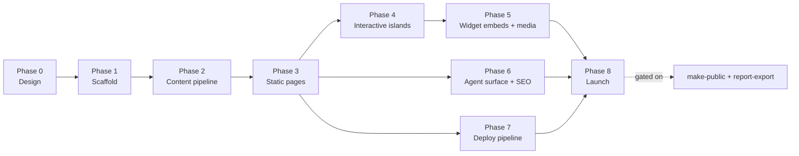

# Marvin website — implementation plan

**Status:** draft 1 · 2026-07-17
**Companions:** [website-requirements.md](website-requirements.md) (FR-1…24 + Decisions
log) · [website-progress.md](website-progress.md) (live status) ·
[premium-page-research.md](premium-page-research.md) (design research)

This plan turns the approved design into a shippable site. It is organised as eight
phases that run mostly in sequence; the dependency graph below shows where work can
overlap. Every phase states its goal, its tasks, the requirements it satisfies, and the
exit criteria that let the next phase start.

## What we are building

A five-page static site for the marvin plugin, built with Astro and a few Preact islands,
deployed to Vercel at `marvin-toolkit.dev`. The site lives in the monorepo as the
`packages/site` workspace, derives its command catalog and counts from the plugin sources
at build time, and reuses the widget theme tokens so the embedded widgets look native.
The full rationale is in the requirements document; this plan does not restate it.

## Phase 0 — Design and specification

**Goal.** Settle every design and product decision before any code is written.

This phase is complete. It produced the requirements document, the low-fi wireframes for
all five pages, the approved visual direction ("Large friendly letters" on the widget
tokens, Hanken Grotesk display, light canonical theme), the hi-fi mockups of the home
page and the four inner pages, and the premium-page design research with its
adopt/adapt/reject decisions. All open questions are closed; see the Decisions log in the
requirements document.

**Exit criteria (met).** Five pages designed at hi-fi fidelity, all decisions recorded,
research folded into the requirements.

## Phase 1 — Workspace scaffold

**Goal.** Stand up an empty but correctly themed Astro site inside the monorepo.

**Tasks.**

- Create the `packages/site` workspace with Astro and the Preact integration; name the
  package `@marvin-toolkit/site`. The root `packages/*` workspace glob picks it up
  automatically.
- Add the shared layout: the sticky navigation bar and the footer from the mockups.
- Port the theme system as a token module that mirrors `.mvroot`
  (`packages/marvin-widgets/src/theme/tokens.ts`) — the same custom properties, light
  values plus the `prefers-color-scheme` dark block and the `data-theme` overrides.
- Self-host the fonts: the Hanken Grotesk variable latin subset (about 35 KB) and
  JetBrains Mono, both as local `woff2` with `font-display: swap`.
- Add the blueprint-grid utility and the shared primitives (buttons, badges, code blocks,
  cards) as Astro components or a small CSS module.
- Wire the workspace into CI so `lint`, `build`, and `format:check` cover it.

**Requirements.** FR-1 (nav and footer), FR-3 (both themes on the shared tokens).

**Exit criteria.** `npm run dev -w @marvin-toolkit/site` serves a themed empty shell; the
theme toggle and the OS preference both work; the fonts render without a flash of
fallback.

## Phase 2 — Content pipeline

**Goal.** Generate the command catalog, the counts, and the version from the plugin
sources so the site never carries a hand-maintained number.

**Tasks.**

- Write a build-time script that reads `plugins/marvin/mcp/server/src/prompts/index.ts`,
  the `SKILL.md` frontmatter (name, description, trigger phrases), and
  `plugins/marvin/.claude-plugin/plugin.json`, and emits typed JSON.
- Define the shared type for a catalog entry (command, group, description, triggers) and
  the counts object (prompts, tools, agents, widgets, version).
- Run the script as a prebuild step so the JSON is always fresh.
- Add a drift guard in the spirit of `lint:docs` so a stale catalog fails CI rather than
  shipping.

**Requirements.** FR-5 (counts), FR-10 and FR-12 (catalog), FR-20 (the pipeline itself).

**Exit criteria.** The JSON regenerates on every build; the counts shown on the site match
the plugin registry exactly; CI fails if the committed catalog drifts from source.

## Phase 3 — Static pages

**Goal.** Build the three non-interactive pages and the static shell of the two
interactive ones, porting the hi-fi mockups to Astro.

**Tasks.**

- Build the home page: the `/marvin` command wordmark hero, the tagline with "without
  panic" accented, the terminal ⇄ widget parity pair (overflowing the shell as the single
  grid break), the counts band, the workflow strip with the learn loop, the day-one
  stories linked to their proof artifacts, the `.marvin/` tree and the memory cycle, the
  toolbox teaser, the "call it your way" block, the engineering strip, and the install
  repeat.
- Build the Pipeline page: the blueprint texture, the tick-and-node stage rail, the four
  stage cards with poster placeholders, the lessons loop, and the under-the-hood cards.
- Build the Quickstart page: the prerequisite callout, the four numbered steps with rail
  connectors, the next-step cards, and the agent-native note.
- Render the static shell of Commands and Toolbox (headers, layout, non-interactive
  content) so Phase 4 only adds behaviour.

**Requirements.** FR-4, FR-6, FR-7, FR-8, FR-9, FR-10, FR-11, FR-15, FR-16, FR-19.

**Exit criteria.** Three pages render fully static; both themes hold; layouts respond from
360 px to 1440 px; Lighthouse scores at least 95 in every category with no JavaScript
shipped yet.

## Phase 4 — Interactive islands

**Goal.** Add the three client-side behaviours, each as a small Preact island.

**Tasks.**

- Command search and filter: fuzzy search over name, description, and trigger phrases,
  combined with the seven group filter chips, reading the catalog JSON with no backend.
  Add the `/` keycap that focuses the field, and reflect the query and group in the URL
  (`?q=`, `?group=`).
- Theme toggle: switch `data-theme` on the root, persist the choice, and respect the OS
  preference as the default.
- Wire the Toolbox demo canvas as an island in Phase 5; in this phase, only its Live and
  Screenshot toggle state.

**Requirements.** FR-2 (copy buttons), FR-3 (toggle), FR-13 (search), FR-14 (URL state).

**Exit criteria.** Search filters instantly and offline; the filtered view is shareable by
URL; the toggle persists across reloads; islands hydrate without layout shift; Lighthouse
stays at least 95.

## Phase 5 — Widget embeds and media

**Goal.** Make the Toolbox demos live and add the terminal recordings.

**Tasks.**

- Embed the committed widget HTML (`plugins/marvin/widgets/*.html`) in sandboxed iframes,
  fed mock data fixtures, theme-synced through the widgets' `data-theme` attribute. Keep
  the demo canvas inline — no modal dialogs. Fall back to a static screenshot where
  embedding fails.
- Record the terminal sessions for the hero and the four pipeline stages with asciinema;
  render them poster-first with no autoplay, showing a play control and a duration.
- Produce the mock fixtures for each widget so the demos have realistic content.

**Requirements.** FR-9, FR-14 through FR-18.

**Exit criteria.** Every widget demo renders with mock data and follows the site theme;
recordings are poster-first and never autoplay; nothing opens in a modal.

## Phase 6 — Agent surface, SEO, and analytics

**Goal.** Add the machine-facing surface and the measurement.

**Tasks.**

- Serve `llms.txt` — an agent-readable product summary, the install commands, and the
  documentation map — and document the agent-install path in the Quickstart.
- Add SEO hygiene: per-page meta tags, an OpenGraph image per page, a sitemap, and robots
  directives.
- Add Vercel Analytics with two custom events that mirror the success criteria:
  `install_copy` and `github_click`.

**Requirements.** FR-22 (analytics), FR-23 (SEO), FR-24 (agent surface).

**Exit criteria.** `llms.txt` is served and accurate; every page has an OG image; both
custom events fire in a preview deploy.

## Phase 7 — Deploy pipeline

**Goal.** Continuous preview deploys and a production build from the private repository.

**Tasks.**

- Create the Vercel project pointed at the `packages/site` workspace, with the build and
  output settings for an Astro static build.
- Skip the build when neither the site nor the plugin sources changed.
- Enable preview deployments on pull requests.
- Configure the `marvin-toolkit.dev` domain and its DNS (production stays unpublished until
  Phase 8).

**Requirements.** The hosting and placement decisions in the requirements document.

**Exit criteria.** Every pull request gets a preview URL; the production project builds
green from the private repository.

## Phase 8 — Launch

**Goal.** Take the site public.

This phase is gated on two dependencies outside the site itself:

1. **Repository publication.** `/plugin marketplace add real-case/marvin-toolkit` only
   works for visitors once the repository is public, so the primary call to action is
   inert until then.
2. **Report export.** The Toolbox advertises PDF and Markdown export (FR-18); the
   template-only feature behind it must land first. Its spec is written and sealed
   (`.marvin/task/002-report-export-template.md`) and awaits implementation.

**Tasks.** Flip the domain to production, verify analytics in production, and submit the
site where the project is listed.

**Exit criteria.** The public site is live at `marvin-toolkit.dev` with a working install
call to action.

## Sequencing summary

| Phase | Depends on | Can overlap with |
|-------|-----------|------------------|
| 1 Scaffold | Phase 0 | — |
| 2 Content pipeline | Phase 1 | — |
| 3 Static pages | Phase 2 | — |
| 4 Interactive islands | Phase 3 | Phase 6, 7 |
| 5 Widget embeds + media | Phase 4 | Phase 6, 7 |
| 6 Agent surface + SEO | Phase 3 | Phase 4, 5, 7 |
| 7 Deploy pipeline | Phase 3 | Phase 4, 5, 6 |
| 8 Launch | Phases 5, 6, 7 + gates | — |

Phases 1 through 3 are strictly sequential because each builds on the last. Once the
static pages exist, the interactive work, the SEO and agent surface, and the deploy
pipeline can proceed in parallel. Launch waits on the media-complete site, the deploy
pipeline, and the two external gates.
