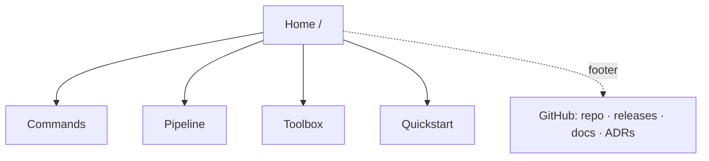

# Marvin website — functional requirements

**Status:** draft v2.2 · 2026-07-17 · compiled from the owner requirements interview and
the positioning discussion that followed; every open question is resolved (see Decisions
log).
**Wireframes:** [low-fi wireframes v2.3](https://claude.ai/code/artifact/53bdc9b0-8d62-4304-afb0-e2865212c575) (private artifact; IA map plus all five page frames with annotations).
**Research:** [premium-page-research.md](premium-page-research.md) (2026-07-17) —
first-party audits of twelve premium flagships; grounds the research-informed
refinements below.

## Purpose

The site is a hybrid of a product landing page and a reference companion for the marvin
plugin. It exists to convert a visitor into a user and to route them into the repository,
and it doubles as an engineering-portfolio surface for the author. Two visitor actions
count as success, with equal weight: the visitor copies the install commands, or the
visitor proceeds to the GitHub repository.

## Positioning

**Tagline:** "Claude Code toolset for AI-assisted development without panic."

**Thesis:** install the toolbox into your project and you get lightweight spec-driven
development — a real workflow rather than unstructured prompting, without the ceremony of
heavyweight process. The site never mocks any way of working: vibe coding is framed as an
upgrade path, not a failure.

The narrative rests on five claims, each backed by a visible proof on the site:

| Claim | Proof on the site |
|-------|-------------------|
| A workflow out of the box that learns: spec → implement → verify → deliver → learn, with fail-closed gates, security scans, decision records, a full PR lifecycle, and lessons fed back into the next spec | Workflow strip on Home; the Pipeline tour with its lessons loop |
| Artifacts live in your project: specs, reports, board, handoffs are versioned with the code — no SaaS, no accounts | The `.marvin/` directory tree block on Home |
| Agent memory the team inherits: lessons are captured at delivery and debugging, recalled at task start, and shared through git | The memory-cycle block on Home |
| An analytical dashboard keeps you oriented: board, artifacts, lessons, ADR corpus, local-only usage log | Live dashboard demo |
| Everything is interactive as MCP Apps widgets — and everything also works as plain text in any terminal | The terminal ⇄ widget split in the hero; the Toolbox page |

**Mission triad** the copy keeps returning to: make development easier, make the critical
steps deterministic (gates and checks are tools, not prompt luck), and keep you oriented
about what is happening in the project.

**Day-one stories** used across the copy: pull requests arrive structured, documented,
and linked to their task, so project history reads easily; requirements are formalized
into a spec that lives in the repo and can be rerun at any time; the dashboard means you
never lose the plot.

## Audiences

The site serves three audiences, in priority order:

1. **Claude Code developers** who want a ready-made working process — commands, the task
   pipeline, the board tracker, and the security scanners.
2. **Team leads and tooling evangelists** who evaluate maturity: process discipline,
   security posture, and documentation quality.
3. **Recruiters and employers** who read the project as the author's portfolio and look
   for evidence of engineering culture.

Open-source contributors are deliberately not a v1 audience; `CONTRIBUTING.md` on GitHub
covers them.

## Information architecture

The site is a five-page smallsite. A changelog page is intentionally absent — the footer
links to GitHub Releases instead. There is no dedicated architecture section in v1; a
compact engineering-credibility strip on the home page carries that duty and links into
the GitHub corpus.

| Page | Route | Job |
|------|-------|-----|
| Home | `/` | Tell the five-claim story: value, install, proofs, teasers |
| Commands | `/commands` | Searchable, filterable catalog of all 51 commands |
| Pipeline | `/pipeline` | Guided tour of spec → implement → verify → deliver |
| Toolbox | `/toolbox` | The visual layer: all 9 widgets with live demos, export, terminal parity |
| Quickstart | `/quickstart` | From zero to the first command in about a minute |

## Functional requirements

Priorities follow MoSCoW: **M** must ship in v1, **S** should ship unless it endangers the
schedule, **C** could ship later.

### Global

- **FR-1 (M)** — Every page shares a global navigation bar (logo, links to the four inner
  pages, GitHub link, theme toggle) and a footer (repository, releases, GitHub docs, MIT
  license, author link, analytics disclosure).
- **FR-2 (M)** — Every command snippet offers copy-to-clipboard.
- **FR-3 (M)** — The site ships light and dark themes. Light is the canonical theme (it
  leads the design and the promotional imagery); dark ships at full parity via
  `prefers-color-scheme` and a manual toggle. The palette derives from the widget theme
  tokens (`packages/marvin-widgets/src/theme/`), so the site and the embedded widgets
  read as one system.

### Home

The home page tells the positioning story in order; block order is the narrative.

- **FR-4 (M)** — The hero leads with the product's own invocation as the wordmark —
  `/marvin:` set in mono, with the `/` and `:` syntax in the accent color — so the
  headline literally shows how you call it and rhymes with the `/marvin:verify` line in
  the adjacent terminal. The tagline sits directly beneath it ("without panic" accented
  by color, not scale), and the thesis follows as the subhead. It shows the two install
  commands with copy buttons, offers a GitHub call to action, and proves terminal ⇄
  widget parity with a split media panel: the same command shown as terminal output and
  as its rendered widget. (The nav logo keeps the plain "Marvin" wordmark.)
- **FR-5 (M)** — A counts strip (51 prompts · 13 tools · 10 agents · 9 widgets · MIT) is
  rendered from generated data (FR-20), never hand-written.
- **FR-6 (M)** — A workflow strip presents the pipeline stepper closed into a loop
  (spec → implement → verify → deliver → learn) plus the command groups around it
  (commit and `pr-*`, `sec-*`, `adr-*`, `refactor-*`, `track-*`), linking to the
  Pipeline tour and the catalog groups. The learn step states that lessons captured at
  delivery are recalled at the next spec.
- **FR-7 (M)** — A "what changes on day one" block tells the three stories: pull requests
  that read well, requirements that become rerunnable specs, and a dashboard that keeps
  you oriented. Each story links to the artifact class that proves it — a spec file,
  `verification.md`, the ADR index — rather than to a marketing anchor.
- **FR-8 (M)** — An artifacts-in-your-repo block renders the `.marvin/` directory tree
  with one-line explanations, paired with the memory cycle (captured at delivery and
  debugging → recalled at task start → shared through git).
- **FR-9 (M)** — A visual-toolbox teaser embeds three live widgets (help, dashboard,
  reports) with the parity line ("interactive in MCP Apps hosts, plain text in any
  terminal") and links to the Toolbox page.
- **FR-10 (S)** — A "call it your way" block replaces the former "three doors" framing:
  the same workflow invoked as a chat phrase, `/commit`, or `/marvin:commit`, authored
  once so behavior never drifts. It is paired with the catalog teaser (search mock and a
  browse call to action).
- **FR-11 (S)** — An engineering-credibility strip shows the ADR count, CI status, and
  test signal, and links into the GitHub corpus. This strip serves audiences 2 and 3 in
  place of a dedicated architecture section.

### Commands

- **FR-12 (M)** — The catalog renders all 51 commands from generated data, organised by
  the seven command groups.
- **FR-13 (M)** — Client-side search covers command name, description, and trigger
  phrases, combined with group filter chips. No backend is involved. The search field
  carries a `/` keycap hint, and pressing `/` focuses it (implemented inside the
  existing search island — no additional JavaScript island).
- **FR-14 (S)** — Search and filter state is reflected in the URL (`?q=`, `?group=`) so a
  filtered view can be shared as a link.

### Pipeline

- **FR-15 (M)** — The tour walks the four stages (spec → implement → verify → deliver)
  and closes with the lessons loop. Each stage presents a short narrative, the artifacts
  it produces (spec file, `verification.md`, pull request), and an animated terminal
  recording. The spec stage emphasises that a spec is a durable artifact: you can leave
  it and return to run it later, with relevant lessons recalled at intake. The loop
  stage shows that lessons are captured at delivery and by the debugger agent, stored in
  `.marvin/memory/`, and recalled at the next task's intake. "Under the hood" notes
  introduce the `spec` Definition-of-Ready gate, the `verify` quality gates, and the
  `lessons` team-memory store. Recordings are poster-first and never autoplay; the
  stage connectors carry the blueprint tick-and-node ornament.

### Toolbox

- **FR-16 (M)** — The page presents all 9 widgets as a user journey — arrive (`help`),
  steer (`dashboard`, `task-list`, `tracker-list`), review and share (`reports`, `audit`,
  `task-summary`, `handoffs`) — with live interactive demos: the committed self-contained
  widget HTML embedded in sandboxed iframes and fed mock data. A static screenshot is the
  fallback where embedding fails. The demo canvas is inline on the page; modal dialogs
  are avoided throughout the site.
- **FR-17 (S)** — Embedded demos follow the site theme via the widgets' `data-theme`
  attribute, and a parity block shows the same data as plain terminal text.
- **FR-18 (M)** — The reports context advertises export to PDF and Markdown. The export
  is generated by Claude itself in the user's session; the toolbox provides only the
  print-quality template (styled on the widget theme tokens) and the instructions — no
  PDF code ships in the server. The claim depends on that template-and-instructions
  feature landing (see Launch gates); the site must not ship the claim before it does.

### Quickstart

- **FR-19 (M)** — The page states prerequisites, walks the two-command install, confirms
  success via `/marvin:help` (noting that in Claude Desktop this renders as the help
  widget), and demonstrates the first workflow — `/marvin:task-start`, formalizing a
  requirement into the first rerunnable spec — before linking onward to the GitHub
  documentation.

### Content pipeline

- **FR-20 (M)** — A build-time script reads `prompts/index.ts` (the command registry —
  identity and order), the curated command reference `help-content.ts` in
  `@marvin-toolkit/mcp-shared` (blurbs, descriptions, and trigger phrases — the source the
  `help` tool and widget already share, so the site catalog and the embedded widget read as
  one system), and `plugin.json`, and emits typed JSON that the site consumes. The catalog,
  the counts, and the version all derive from it; the site carries no hand-maintained numbers.
- **FR-21 (S)** — CI builds the site when plugin sources change, so a catalog regression
  surfaces before deploy rather than after.

### Analytics and SEO

- **FR-22 (S)** — Privacy-friendly analytics via Vercel Analytics, with no cookies and no
  consent banner. Two custom events mirror the success criteria: install-command copied
  and GitHub link clicked.
- **FR-23 (S)** — Standard SEO hygiene: meta tags, OpenGraph image per page, sitemap, and
  robots directives.

### Agent-native surface

- **FR-24 (S)** — The site serves `llms.txt` — an agent-readable summary of the product,
  the install commands, and the documentation map — and the Quickstart documents the
  agent-install path. Precedent: Resend, Liveblocks, and Clerk all ship agent-facing
  doors; for a product that is itself an MCP server this is the most on-brand emerging
  convention (premium-page-research.md, Axis 4).

## Non-functional requirements

- **Language.** All content is English.
- **Tone.** Engineering-restrained and never condescending: no mockery of any way of
  working — vibe coding is an upgrade path, not a failure. Marvin's humor appears only as
  decorative accents (short quips in ornamental slots) and never inside reference or
  instructional content.
- **Performance.** Static-first Astro output with JavaScript islands limited to search,
  the theme toggle, and widget embeds. Target Lighthouse ≥ 95 in every category.
- **Accessibility.** Search, filters, and toggles are keyboard-operable; pages use
  landmarks; focus is visible; contrast follows the token palette.
- **Responsiveness.** Layouts hold from 360 px to 1440 px.

## Technical decisions

- **Framework:** Astro, with Preact islands where interactivity is needed — the same
  UI stack the widget workspace already uses.
- **Placement:** a monorepo workspace at `packages/site` (the `packages/*` workspace glob
  picks it up automatically; suggested package name `@marvin-toolkit/site`).
- **Hosting:** Vercel, with preview deployments on pull requests. The project root points
  at the site workspace, and builds are skipped when neither the site nor the plugin
  sources changed.
- **Domain:** `marvin-toolkit.dev` (decided 2026-07-17).
- **Design direction:** "Large friendly letters" (approved 2026-07-17). The palette is
  the widget theme tokens verbatim — zero new colors, so embedded widgets look native.
  The display face is Hanken Grotesk — a humanist grotesk chosen for warmth without the
  wonk — reserved for the product name, section headings, and count digits; body text
  uses the system stack the widgets already use;
  commands, paths, section eyebrows, and quips speak JetBrains Mono. The hero leads with
  the name; "without panic" is accented by color, never scale. One orchestrated motion
  moment (the hero terminal ⇄ widget parity); the rest of the page stays still.
- **Research-informed refinements** (premium-page-research.md): the violet fill appears
  exactly once per viewport — every other action is a zinc surface or a hairline ghost,
  and the `--acbg` tint carries the everyday accent. Pages use a two-tier container:
  a 1200 px shell, a ≤72ch text measure, and a ~1360 px hero-media tier. A
  blueprint-grid texture (zinc hairlines at ≤6% alpha on an 8-px-multiple pitch) grounds
  the hero and the closing install section. The hero terminal ⇄ widget pair overflowing
  the shell is the page's single deliberate grid break. Terminal recordings are
  poster-first and never autoplay. The pipeline tour and the `.marvin/` tree carry
  schematic tick-and-node ornament drawn in the border zinc.
- **Terminal recordings:** the asciinema player — the premium, interactive option
  (selectable text, play and pause); recordings ship as `.cast` files.
- **GitHub presence:** the navigation carries a plain GitHub link. No star count at
  launch; revisit once stars accumulate.

## Launch gates

Two dependencies couple the public launch to work outside the site itself. Both have moved
since this document was written; the status below is current as of 2026-07-20.

1. **Repository publication — met.** `real-case/marvin-toolkit` is public, so
   `/plugin marketplace add real-case/marvin-toolkit` works for visitors. (Vercel builds
   from a private repository without issue, so this never blocked implementation or preview
   deployments — only the public launch was coupled to the make-public milestone.)
2. **Report export — in review.** The site advertises exporting reports to PDF and Markdown
   (FR-18). The feature follows the template-only architecture: Claude generates the export
   in the user's session, and the toolbox ships the print-quality template (on the widget
   theme tokens) plus the instructions — no export code in the server. It is implemented and
   open as PR #133 into `dev`; the site must still not ship the FR-18 claim publicly until
   that merges.

## Out of scope for v1

Russian localization, per-command pages, a dedicated architecture and ADR section, an
on-site changelog, a blog, a video walkthrough, and cookie-based analytics are all out of
scope for the first release.

## Decisions log

Every question raised during the interview and the v1–v2 reviews is resolved
(decided 2026-07-17 unless a later date is noted on the entry):

1. **Tagline** — "Claude Code toolset for AI-assisted development without panic".
2. **Domain** — `marvin-toolkit.dev`.
3. **Analytics** — Vercel Analytics; no cookies, no banner.
4. **GitHub star count** — none at launch; plain GitHub link only, revisit once stars
   accumulate.
5. **Terminal recordings** — asciinema player (premium, interactive); `.cast` files.
6. **Toolbox demo canvas** — inline on the page; no modal dialogs anywhere on the site.
7. **Quickstart first workflow** — `/marvin:task-start`.
8. **"Three doors" naming** — replaced with "call it your way" across the living
   repository documentation (README, CLAUDE.md, CONTRIBUTING, `docs/`, skill prose).
   Accepted ADRs and changelogs keep the historical term, following the ADR-0031
   precedent.
9. **Report export** — committed as PDF + Markdown, generated by Claude from a
   toolbox-provided template (no export code in the server); a launch gate for the
   site.
10. **Design direction** — A, "Large friendly letters", on the widget tokens verbatim.
11. **Display face** — Hanken Grotesk (H1/H2 and count digits only, self-hosted variable
    subset). Chosen over Bricolage Grotesque, whose deliberate wonkiness read as
    unserious for an engineering product; a humanist grotesk keeps the friendly tone
    without the irregularity. Runners-up in the specimen: Schibsted Grotesk (cleaner),
    Familjen Grotesk (more character).
12. **Canonical theme** — light; dark at full parity via the OS preference and the
    toggle.
13. **Content-pipeline source (2026-07-19, amended)** — FR-20's catalog data comes from the
    curated `help-content.ts` in `@marvin-toolkit/mcp-shared` (the source the `help` tool and
    widget already share), not from parsing `SKILL.md` frontmatter as first worded: only 37 of
    the 51 commands have a `SKILL.md`, whereas `help-content` covers all 51 with
    coverage-guarded trigger phrases, so the site catalog and the embedded help widget stay
    identical. Shipped in Phase 2 (PR #126).
