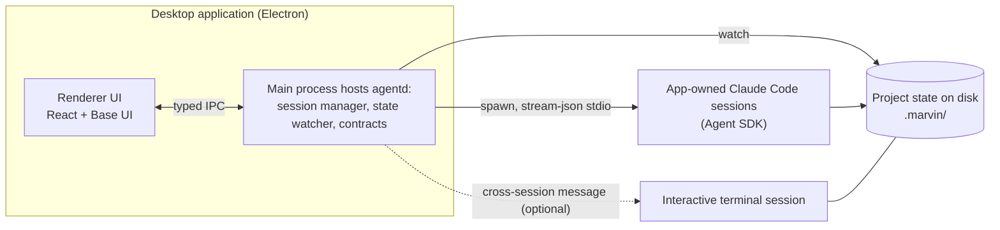

# Proposal: Standalone Desktop Application

| Field      | Value |
| ---------- | ----- |
| Status     | Proposed |
| Date       | 2026-08-31 |
| Applies to | A new, separate repository. Nothing in marvin-toolkit changes now; marvin is the product this application is intended to eventually replace |
| Audience   | A single user (the owner) at first; marvin's audience once the product matures |
| Principle  | Reading project state never waits for a model and never costs tokens. The terminal and the app are peer clients over the same on-disk state. |

## Motivation

The MCP Apps widget layer proved marvin's data model, but chat turned out to be the wrong surface
for it. Every render requires a model turn and a tool call, so the dashboard pays latency and
tokens for what is fundamentally a file read. A widget also lives inside the transcript, so it
scrolls away and cannot be kept in view while working. And the host that spawns the plugin server,
the Claude Code CLI, renders no widgets at all (ADR-0034), so the terminal audience never sees the
rich layer in the first place.

The owner's decision of 2026-08-31 is to build a standalone desktop application for macOS, in its
own repository, as its own product. It starts as a personal tool with exactly one user and is
intended to replace marvin over time. Existing widget HTML is explicitly not reused; the product
gets its own interface. What carries over is practice, not code: token-based theming, contract
discipline, and file-first state.

## Product shape

The application is a project-bound control panel for AI-assisted development. It shows the live
state of the current project — dashboard, task board, specs in flight, reports — and lets the user
act on it: a "Start new task" button opens an intake conversation, a board card moves through its
lifecycle, a report opens as a readable document. Actions that need a model run as Claude Code
sessions surfaced in the app's own chat panel. Actions that do not (board moves, configuration)
execute instantly without one.

Because it is a desktop application rather than a browser tab, it can also behave like a system
utility: a menu bar presence with a popover board, native notifications when a verification run
fails or a session finishes, an always-on-top mini view, and a `marvin://` deep link so a terminal
session can summon it with one `open` command.

## Architecture

The system splits into two channels with very different difficulty, plus one isolation decision
that keeps the rest reversible. The diagram shows how the pieces relate; the sections below give
the reasoning.

### State channel: project to app

All of marvin's state is files, so the app watches the project's state directory and pushes changes
to the UI over typed IPC. No model participates in a read, which resolves both original
complaints structurally: refresh latency drops to filesystem-event speed, and the window is
pinned by nature because it is a window. Payloads are validated with zod contracts, continuing the
schema-per-artifact discipline of `packages/marvin-mcp-shared/contracts/`.

### Command channel: app to Claude Code

Three supported mechanisms exist, with different maturity. The recommendation is to build on the
first and treat the other two as optional extensions.

| Option | Mechanism | Status | Role in this product |
| ------ | --------- | ------ | -------------------- |
| A. App-owned sessions | Agent SDK, or `claude -p --input-format stream-json --output-format stream-json` as a long-lived child process | Stable, documented | Primary. Every command button spawns or reuses a session the app owns and displays |
| B. Cross-session messaging | `SendMessage` between local sessions (public since v2.1.224) | Stable | Optional. Sends a command into the user's live terminal session; receipt is governed by the `crossSessionInbound` setting; plain text only |
| C. Channels | An MCP server that pushes events into a running session | Research preview | Watch. The native fit for this product, but gated behind an allowlist today |

Two approaches were evaluated and rejected. Driving the user's existing session id headlessly with
`--resume` is documented to interleave two transcripts when the session is open elsewhere, and
terminal automation (tmux, AppleScript) is fragile by construction.

With option A the terminal and the app never need to talk to each other directly. Both are clients
over the same on-disk state, which is already marvin's synchronization model. This also finally
supplies the missing piece the `marvin-tm-executor` agent was designed for: batch-dispatch tooling
that feeds specs into `claude -p` sessions.

### The agentd core

The bridge and the watcher form a shell-agnostic TypeScript module, working name `agentd`: the
session manager (spawning, queueing, permission callbacks), the state watcher, and the data
contracts, with no UI dependencies. In Electron it lives in the main process as a library. Any
future shell — Tauri for footprint, Swift for a fully native front — runs the same module as a
sidecar process. This single boundary keeps the shell choice reversible at low cost, which is
worth more than the shell choice itself.

## Session parity: Claude Code commands inside the app's chat

The app's chat is a session run through the Agent SDK, and the SDK drives the same CLI that powers
the terminal, so the command layer transfers: custom slash commands, plugin commands, MCP prompt
commands such as `/marvin:task-start`, skills, and hooks all work in app-owned sessions. Three
integration requirements and two boundaries follow.

The requirements:

1. Pass `settingSources: ['user', 'project']` (and plugin configuration) explicitly. The SDK
   isolates sessions from filesystem settings by default, and without this the session sees no
   plugins and no commands.
2. Build the slash-command autocomplete from the session's `init` message, which lists the
   available `slash_commands`. The app's `/` menu then always matches what the terminal would
   offer, with nothing hardcoded.
3. Render permission requests through the `canUseTool` callback as native dialogs. Plugin guard
   hooks (`bypass-guard`, `secret-guard`) fire in headless sessions exactly as in interactive
   ones, so the enforcement layer survives the move.

The boundaries: built-in commands that open terminal panels (`/permissions`, `/config`,
`/resume`) are host UI, and the app is now the host, so their equivalents become application
screens. Tools that rely on MCP elicitation degrade along their designed `canElicit` path to
plain-text questions; the app can later answer elicitation requests with native forms.

As an escape hatch, the app embeds a full interactive `claude` in a terminal tab (xterm.js with
node-pty). Everything works there, including dialog commands, at the cost of being a terminal
rather than a native chat.

## Shell choice

Electron is the chosen shell. With HTML reuse off the table, the decisive constraint is language:
the Agent SDK exists for TypeScript and Python only, so any non-TS shell either maintains a
hand-rolled implementation of the stream-json control protocol or ships a TS sidecar anyway. The
secondary constraints also point the same way: xterm.js with node-pty is the most mature embedded
terminal stack available, one language maximizes solo velocity, and a cross-platform door stays
open for marvin's existing audience, which is not macOS-only.

| Shell | Assessment |
| ----- | ---------- |
| Electron | Chosen. Agent SDK native, best terminal stack, single language, cross-platform later |
| Tauri 2 | Deferred. Buys footprint at the price of a Rust layer plus a Node sidecar; the agentd split keeps this migration cheap if it ever pays |
| Swift/SwiftUI | Rejected unless macOS-only is accepted as permanent. Best OS citizenship, but a second language and a sidecar for the bridge |
| PWA / browser | Superseded by this proposal; remains the fallback delivery if a zero-install variant is ever needed, with the localhost hardening that entails |

Electron also removes the localhost attack surface the browser variant carried: there is no HTTP
listener at all, and the renderer talks to the main process over internal IPC.

## Frontend stack

The following choices are fixed by owner decision, with the reasoning recorded here.

- React 19 with TypeScript on electron-vite. React was chosen over Angular (both known to the
  owner) because the product is built agent-first, and the model corpus advantage compounds every
  session; the specific surfaces (terminal, palette, markdown) are also React-first. Angular's
  genuine counterargument — the first-party CDK covering drag-and-drop, virtual scrolling, and
  tree views, plus `ng update` migrations — is acknowledged and declined.
- CSS Modules instead of Tailwind, with a token stylesheet as the single home for literal colors:
  custom properties on `:root`, light and dark themes via `prefers-color-scheme`, pinnable with
  `data-theme`. This ports the `.mvroot` practice without porting its code.
- Base UI (`@base-ui/react`) as the headless component layer, verified against current
  documentation: parts take per-part `className` (CSS Modules are a documented first-class
  pattern), states style through data attributes (`data-open`, `data-starting-style`,
  `data-ending-style` for enter and exit transitions), composition uses the `render` prop, and
  the app root needs `isolation: isolate` so portalled popups stack correctly.
- Known gaps and their fills: drag-and-drop for the board (pragmatic-drag-and-drop or dnd-kit),
  virtualization (TanStack Virtual), a self-built tree view, and a command palette assembled from
  Base UI's Dialog and Combobox.
- react-markdown with shiki for spec and report bodies; xterm.js with node-pty for the embedded
  terminal; typed IPC over zod contracts; file-first persistence with SQLite added only when
  queries outgrow files.

## Distribution before signing

The solo phase needs no Apple Developer ID, indefinitely. Gatekeeper reacts to the quarantine
attribute, which only downloading applications (browsers, mail, AirDrop) set; a locally built app
never has it. Apple Silicon's signing requirement is satisfied by the ad-hoc signature
electron-builder applies automatically when no certificate is present; set
`CSC_IDENTITY_AUTO_DISCOVERY=false` so builds are quiet about it.

Two things are unavailable without an ID. Auto-update does not work, because Squirrel.Mac refuses
unsigned applications — irrelevant while updating means rebuilding. And the polished
browser-download experience requires notarization. Both arrive additively as CI steps when the
public phase begins; nothing built earlier changes.

| Phase | Delivery | Developer ID |
| ----- | -------- | ------------ |
| Personal tool | Local build | Not needed |
| Early users | git or npx delivery (no quarantine attribute); unsigned artifact on a GitHub Release as fallback | Not needed |
| Public product | Signed, notarized `.dmg` with auto-update | Required (USD 99/year) |

One irreversible choice belongs to day one: the bundle identifier. macOS ties granted permissions
and settings to it, and changing it later resets them.

## Delivery stages

1. A read-only live dashboard: the state watcher, the contracts, and views over them. Small, and
   it already resolves both complaints that motivated the product.
2. Deterministic actions without a model: board lifecycle, configuration editing.
3. Model workflows: app-owned sessions with the chat surface, permission dialogs, and a
   queue. This is the large stage and carries the product decisions.

## Coexistence with marvin during the transition

The app reads the same `.marvin/` state the plugin writes, so both can serve one project
simultaneously from day one. For deterministic operations the app may drive the plugin's committed
`dist/server.js` over stdio — the exact pattern `scripts/mcp-call.mjs` and
`bin/widget-preview.mjs` already prove — rather than reimplementing storage logic before it has
to. Replacement of marvin proceeds surface by surface, and the plugin remains fully functional
for terminal-only users throughout.

## Risks and open questions

- Concurrent writes to shared state are last-write-wins today; acceptable for card files, but the
  assumption should be recorded and revisited if the app gains heavier writers.
- macOS GUI applications do not inherit the login shell's PATH, so `claude` and `node` must be
  resolved through a login-shell probe at startup.
- The Agent SDK surface is young; pin versions and wrap it inside agentd so churn stays local.
- Channels may graduate from research preview, which would strengthen option C; track it.
- Stage 3 still requires a queue for model-backed actions. Cost and token spend are outside the
  application's responsibility by owner decision (2026-08-31): the app shows no prices and keeps
  no price data, and spend tracking stays with Anthropic's own tooling.
- Whether the final product remains macOS-only is a market decision, deliberately left open by
  choosing Electron.
- The product name is not chosen.

## References

- Channels (research preview): https://code.claude.com/docs/en/channels.md
- Cross-session messaging: https://code.claude.com/docs/en/cross-session-messaging.md
- Headless mode and stream-json: https://code.claude.com/docs/en/headless.md
- Session and resume semantics: https://code.claude.com/docs/en/sessions.md
- ADR-0034 — why chat widgets never render under the CLI host (this repository)

## Decision log

Owner decisions of 2026-08-31, fixed in the authoring conversation: a separate repository and
separate product intended to replace marvin; Electron as the shell; React over Angular; CSS
Modules over Tailwind; Base UI as the component layer; the solo phase runs without an Apple
Developer ID; the application displays no prices or cost figures — spend tracking is outside its
responsibility.
