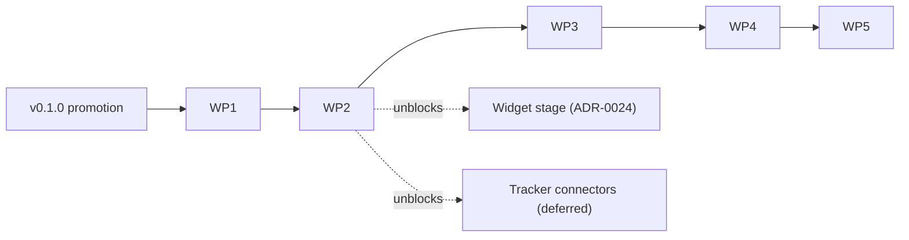

# Proposal: Kanban Group Rework

| Field      | Value                                                                                                    |
| ---------- | -------------------------------------------------------------------------------------------------------- |
| Status     | **Implemented** 2026-07-02 — all five work packages merged (WP5 last: #63, plugin 0.6.0); 19/19 audit findings closed; execution record in [kanban-rework-progress.md](./kanban-rework-progress.md) |
| Date       | 2026-07-02                                                                                                 |
| Applies to | `kanban-*` prompt group; `task` / `git` / `help` MCP tools; `commit` and `pr-create` skills; shared contracts |
| Origin     | Effectiveness audit of the kanban command group, its tools, and related agents/skills (2026-07-02)         |
| Related    | [ADR-0019](../adr/0019-branching-and-pr-flow.md), [ADR-0023](../adr/0023-pr-command-family.md), [ADR-0024](../adr/0024-mcp-apps-widget-architecture.md); planned ADR-0025 and ADR-0026 |

## Motivation

An effectiveness audit of the kanban group found the foundation sound — malformed-file
isolation, a coercion-safe YAML codec, registry-derived help, and dirty-tree guards all work
as designed — but identified three systemic problems and a set of smaller defects (the full
register is in [Appendix A](#appendix-a--audit-findings-register)):

1. **Elicitation is the only input channel.** The `task` and `git` tool schemas accept almost
   no data arguments, so every write flow depends on MCP elicitation. Hosts without
   elicitation support cannot use the group at all, natural-language intent text is discarded
   and re-asked by the form, and agents cannot drive the board programmatically.
2. **Two git flows with diverging guarantees.** `kanban-commit` and `kanban-create-pr`
   duplicate the `commit` and `pr-create` skills with weaker safety: the tool stages blindly
   with `git add -A` while the skill detects sensitive files, and the tool calls
   `gh pr create` without pushing the branch. ADR-0023 already decided that the PR lifecycle
   is prose/skill-driven and that the `git` tool is not extended; the kanban pair is the
   leftover that contradicts it.
3. **A closed status vocabulary.** The status enum (`todo | wip | review | done | blocked`)
   is hard-coded in the storage schema, the widget contracts, the transition logic, and the
   renderers. A tracker workflow with different or additional states (Jira, Azure DevOps,
   YouTrack) cannot be represented, and even the built-in `blocked` status is unreachable
   because no action sets it.

## Design decisions

Two decisions were made during the audit review and anchor this plan. Each gets its own ADR
when the corresponding work package lands.

### D1 — Git operations move to the `commit` and `pr-create` skills (planned ADR-0025)

The kanban group keeps board operations only. The `commit` skill gains kanban awareness (a
`Refs: <id>[, <tracker_id>]` footer when the current branch is linked to a task), and the
`pr-create` skill gains task context in the PR title and body, an explicit push step, and a
call to a new deterministic `task` action `link-pr` that persists the PR URL onto the task
frontmatter — preserving the ADR-0024 widget data source. The `git` MCP tool is retired.

### D2 — Statuses become project data; roles stay closed (planned ADR-0026)

The status vocabulary moves to `.marvin/config.json`, while lifecycle semantics remain a
closed set of **roles**. Each configured status carries a key (stored in frontmatter), a role
(what the lifecycle commands need to know), and an optional `tracker_status` (the exact
remote workflow name, filled at tracker-connection time — manually first, by a connector
later):

```jsonc
{
  "statuses": [
    { "key": "backlog",     "role": "todo" },
    { "key": "in-progress", "role": "wip",    "tracker_status": "In Progress" },
    { "key": "code-review", "role": "review", "tracker_status": "In Review" },
    { "key": "qa",          "role": "review", "tracker_status": "QA" },
    { "key": "done",        "role": "done",   "tracker_status": "Done" },
    { "key": "blocked",     "role": "blocked" }
  ]
}
```

Lifecycle actions target the first status of their role; a new generic `move` action reaches
every other configured status. When no configuration is present, the default set is five
statuses whose key equals the role, so existing boards parse unchanged. The roles `todo`,
`wip`, and `done` must each have at least one status; `review` and `blocked` are optional.
Unknown statuses in existing files surface through the existing malformed-file channel.

## Versioning and release strategy

The pending v0.1.0 promotion to `main` ships first, unchanged. This plan starts the 0.2.0
line: WP1 removes two prompts and WP2 changes contract shapes, both breaking in the sense of
the project's versioning policy and both acceptable pre-1.0 (the ADR-0023 removal of
`task-fix-pr` is the precedent). The plugin version bumps to 0.2.0 at WP1; later packages
bump per policy (minor for new actions, patch for fixes). Recommended release cuts: one
after WP2 (all breaking changes ship together) and one after WP5.

## Work packages

The packages are ordered by data dependencies rather than by finding severity: first shrink
the surface (WP1 removes a whole tool), then change the data model before it gains consumers
(WP2 must precede the ADR-0024 widget stage), then open the input API (WP3), then build the
configuration surface on top (WP4), and finish with polish and coverage (WP5). Each package
is one topic branch and one PR into `dev` (ADR-0019) and carries its own tests.



### WP1 — Git-operations migration

**Goal:** the kanban group becomes board-only; the plugin has exactly one commit flow and one
PR flow. Implements D1. Absorbs findings 2, 3, 12, 13, 18.

Scope:

- Remove the `kanban-commit` and `kanban-create-pr` prompt entries from
  `plugins/marvin/mcp/server/src/prompts/index.ts` (43 → 41 prompts, kanban 13 → 11).
- Delete `plugins/marvin/mcp/server/src/tools/git.ts` and unwire it in `src/server.ts`.
  The `lib/git.ts` helpers stay — `task` and `help` use them.
- Add a `link-pr` action to the `task` tool: it stores a PR URL on the task frontmatter via
  the existing `setTaskPr`, resolving the task by current branch or an explicit `taskId`.
- Extend `plugins/marvin/skills/commit/SKILL.md` with a kanban-context step that appends the
  `Refs:` footer when the current branch is linked to a board task.
- Extend `plugins/marvin/skills/pr-create/SKILL.md` with task context for the PR title and
  body, an explicit `git push -u` step before `gh pr create`, a `task link-pr` call after
  creation, and an offer to move the linked task to review.
- Update the `runReview` hint text in `tools/task.ts` to point to `/marvin:pr-create`.
- Add "kanban" and "board" wording to the `task` and `help` tool descriptions (they are the
  discovery surface for a group that has no skills).
- Show the captured PR link in the `kanban-list` text table.
- Retarget `test/git-pr-structured.test.mjs` from the `git` tool to `task link-pr`.
- Update `docs/commands.md` (two rows removed, chat phrases fold into the `commit` and
  `pr-create` rows), `CLAUDE.md`, the plugin README, and the CHANGELOG. Write ADR-0025.
- Bump the plugin version to 0.2.0 (plugin manifest, marketplace manifest, server package).

### WP2 — Configurable status model

**Goal:** the status vocabulary is project data validated against configuration; lifecycle
commands operate on roles; contracts are tracker-ready before any widget consumes them.
Implements D2. Absorbs findings 5, 8, 14, and the auto-detection half of 4.

Scope:

- Add `statuses` to the `Config` schema in `src/storage/schema.ts` with the default set and
  the role invariants described under D2.
- Replace the static frontmatter status enum with config-aware validation; route unknown
  statuses through the malformed-file channel with a clear reason.
- Rewrite the transitions in `tools/task.ts` as role-driven (`create`, `start`, `review`,
  `done` target the first status of their role; candidate filters select by role). While
  this code is open: replace the misleading "Cancelled" reply with an honest "no tasks in
  the required status" message (finding 8) and fix the preselected-id path of `runStart`
  (finding 14).
- Add the generic `move` action covering every configured status, which also makes
  `blocked` reachable (finding 5).
- Update the shared contracts (`packages/marvin-mcp-shared/src/contracts/task.ts` and
  `dashboard.ts`): `status` becomes `{ key, role }`, counts become an open record with a
  role roll-up. This must land before the first widget.
- Re-derive the render order in `src/flows/format.ts` and the counters in `tools/help.ts`
  from the configured set, grouped by role priority (wip, review, todo, blocked, done) with
  configuration order within a role.
- Auto-detect `base_branch` from `origin/HEAD` when no configuration file exists.
- Extend the structured-content tests to the new shapes. Write ADR-0026.

### WP3 — Input contract and storage hardening

**Goal:** the model is a first-class caller; elicitation becomes the fallback rather than
the only channel, and the storage layer survives real-world input. Absorbs findings 1, 6, 7,
11, 16.

Scope:

- Widen the `task` input schema with `title`, `description`, `tracker_id`, and `status`
  (for `move`); elicit only the fields that are missing.
- Check the client's elicitation capability in `packages/marvin-mcp-shared/src/elicit.ts`
  and, when absent, return an instructive error listing the missing arguments instead of
  failing on the wire.
- Update the kanban prompt bodies so natural-language intent text ("marvin add a bug:
  login is broken") is passed as arguments instead of being discarded.
- Allow Unicode titles and add a slug fallback for titles that produce an empty slug
  (`src/storage/schema.ts`, `src/storage/slug.ts`).
- Derive `nextSeq` from filenames (including malformed ones) to close the id-collision
  window (`src/storage/tasks.ts`).
- Make task writes atomic (temp file plus rename) and correct the stale comment.
- Generate branch names as `<type-prefix>/<seq>[-<tracker>]--<slug>` (for example
  `fix/003--login-timeout`), aligning with the ADR-0019 convention. Existing tasks keep
  their stored branch names; no migration.

### WP4 — Configuration surface

**Goal:** a first-run and tracker-connection entry point exists; nobody hand-writes
`.marvin/config.json`. Absorbs finding 17 and the remainder of finding 4.

Scope:

- Add a `config` action to the `task` tool (and a `kanban-config` prompt) that shows the
  current configuration and edits `base_branch`, `tracker_url_template`, and `statuses` —
  the place where a tracker's actual statuses are entered today and where a connector will
  write them tomorrow.
- Optionally expose a `branch_template` setting.
- Document the commit-versus-gitignore decision for `.marvin/kanban/` and a short tracker
  connection guide in `docs/commands.md`.

### WP5 — Polish and coverage sweep

**Goal:** close the remaining audit findings and the test-coverage gap. Absorbs findings 9,
10, 15, 19.

Scope:

- Make `kanban-help` call the `help` tool with `section: "kanban"` instead of duplicating
  the full index.
- Add an archive mechanism (or a collapsed count) for done tasks so the board list stays
  readable.
- Mention the board in the `marvin-guide` onboarding agent.
- Sweep the end-to-end lifecycle tests via `scripts/mcp-call.mjs --accept`:
  create → start → move → review → done, malformed-seq collisions, and `link-pr` — anything
  the per-package tests have not already covered.

## Verification protocol (every work package)

Each package rebuilds `dist/server.js` (`npm run build` in `plugins/marvin/mcp/server`) and
passes `node scripts/verify-dist.mjs`, `node scripts/lint-manifests.mjs`, and `npm run test`
before the PR opens. Rebuild after any lint-staged reformatting so the committed dist never
goes stale. Manifest versions are bumped once at WP1 and then per the versioning policy.

## Deferred work

The following stays out of scope and is deliberately not blocked by this plan:

- Tracker connectors that read a workflow from the Jira, Azure DevOps, or YouTrack API and
  write the `statuses[]` section — the configuration schema from WP2 is their interface.
- Two-way status synchronization; `tracker_status` is the future mapping key.
- The widget stage of ADR-0024, which consumes the WP2 contracts.
- A configurable `TaskType` vocabulary. The same key/role pattern applies if it is ever
  needed, but the four types currently anchor four create commands and stay as they are.

## Appendix A — audit findings register

Severity reflects the audit's triage: P1 blocks effectiveness, P2 is a functional gap, P3 is
polish. The WP column is the traceability link into the work packages above.

| #  | Sev | Finding                                                                                  | Location                                   | WP  |
| -- | --- | ---------------------------------------------------------------------------------------- | ------------------------------------------ | --- |
| 1  | P1  | Elicitation is the only input channel; tool schemas accept no data arguments              | `tools/task.ts`, `shared/elicit.ts`        | 3   |
| 2  | P1  | `kanban-create-pr` never pushes; non-TTY `gh pr create` fails on unpushed branches        | `tools/git.ts`                              | 1   |
| 3  | P1  | `kanban-commit` stages blindly with `git add -A`; the `commit` skill detects secrets      | `tools/git.ts`                              | 1   |
| 4  | P1  | `base_branch` defaults to `dev`; first run breaks on main-based repos; no config command  | `storage/schema.ts`, `lib/git.ts`           | 2+4 |
| 5  | P2  | `blocked` status is unreachable; no reverse transitions                                   | `storage/schema.ts`, `tools/task.ts`        | 2   |
| 6  | P2  | Titles are ASCII-only; Cyrillic task titles are rejected                                  | `storage/schema.ts`, `storage/slug.ts`      | 3   |
| 7  | P2  | `nextSeq` skips malformed files, allowing duplicate sequence ids                          | `storage/tasks.ts`                          | 3   |
| 8  | P2  | Empty candidate lists report "Cancelled — no changes made"                                | `tools/task.ts`                             | 2   |
| 9  | P2  | `kanban-help` renders the full command index instead of the kanban section                | `prompts/index.ts`                          | 5   |
| 10 | P2  | Lifecycle flows have no test coverage (three structured-payload tests exist)              | `mcp/server/test/`                          | all + 5 |
| 11 | P2  | Generated branch names (`003--slug`) violate the ADR-0019 `<type>/*` convention           | `storage/tasks.ts`                          | 3   |
| 12 | P3  | Tool descriptions lack "kanban"/"board" keywords — the group's only discovery surface     | `tools/task.ts`, `tools/help.ts`            | 1   |
| 13 | P3  | The list table omits the captured PR link (present in structured content only)            | `flows/format.ts`                           | 1   |
| 14 | P3  | `runStart` preselected-id path bypasses status filters and the empty-todo early return    | `tools/task.ts`                             | 2   |
| 15 | P3  | Done tasks accumulate in the list forever; no archive                                     | `tools/task.ts`, `flows/format.ts`          | 5   |
| 16 | P3  | Task writes are not atomic despite the comment claiming so                                | `storage/tasks.ts`                          | 3   |
| 17 | P3  | No commit-versus-gitignore guidance for `.marvin/kanban/`; the toolkit repo does not dogfood the board | docs                          | 4   |
| 18 | P3  | Creating a PR does not offer moving the task to review                                    | `tools/git.ts`                              | 1   |
| 19 | P3  | No agent mentions the kanban board (including the onboarding guide)                       | `agents/`                                   | 5   |
