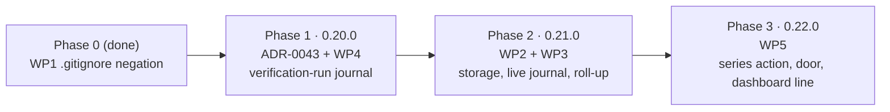

# Task workflow metrics: implementation plan

| Field      | Value                                                                                                     |
| ---------- | --------------------------------------------------------------------------------------------------------- |
| Status     | Implemented, 2026-09-03 — Phase 1 landed as 0.20.0, Phase 2 as 0.21.0, Phase 3 as 0.22.0              |
| Companion  | [task-metrics.md](./task-metrics.md), the proposal this plan implements (Status: Implemented)                 |
| Base       | `dev` at `44707ed` (marvin 0.19.0), the commit that landed WP1                                              |
| Landings   | Three pull requests into `dev`, serial version targets 0.20.0, 0.21.0 and 0.22.0                           |
| Owner gate | The decisions table below lists every point where this plan goes beyond the proposal; each is reversible before Phase 1 starts |

The proposal fixes what is measured, where the records live and why the series is committed.
This plan settles what the proposal leaves to implementation: the file-level design of each
package, the order in which the packages land, the prose sites that have to write the live
events, the tests that prove each package, and the pinned counts and documentation tables that
every landing has to touch. It also answers the proposal's two open questions. The metric set
itself is not restated here; the proposal's identifiers (T1 to T8, Q1 to Q12, R1 to R4) are used
throughout and refer to its tables.

## Prerequisites and ground rules

Every landing follows the repository's standing rules, and two of them bite harder here than
usual.

- Branch off `dev` and open the pull request into `dev`. Never commit to `dev` or `main`.
- Rebuild `dist/server.js` in a checkout that has its own `node_modules`. The worktree this plan
  was written in has none, so a bundle built there is byte-different and not committable. Run
  `npm install` in the worktree first, or settle it with the temp-dir diff CLAUDE.md gives under
  "Validation".
- Bump the version with `npm run sync-version <x.y.z>`, then `npm run build`, then regenerate the
  site catalog with `npm run gen:catalog -w @marvin-toolkit/site`. The catalog embeds the version
  and the tool and prompt counts, and nothing reminds you.
- Add a `CHANGELOG.md` entry under `plugins/marvin/` for each bump, in the existing register.
- Keep Markdown formatter-exempt. `.prettierignore` already excludes `**/*.md`, so a committed
  record under `.marvin/metrics/` is never reflowed by `format:check` or by the lint-staged
  pre-commit hook. A host project that commits its own series should carry the same exclusion,
  and `docs/configuration.md` will say so.
- Mark each work package as landed in the proposal itself, the way
  `docs/proposals/workflow-hardening.md` annotates its packages, rather than opening a separate
  progress document. Three landings do not warrant a status board.

## Decisions the plan makes beyond the proposal

The proposal leaves several implementation choices open, and in two places its own sections
disagree with each other. The table settles each point. Where a decision deviates from the
proposal's stated design, the deviation is named so the owner can overrule it before work starts.

| Id  | Decision                                                                                                                                                                                                                                                                                                                                                                                                 | Relation to the proposal                                                                                                                                                                                                  |
| --- | -------------------------------------------------------------------------------------------------------------------------------------------------------------------------------------------------------------------------------------------------------------------------------------------------------------------------------------------------------------------------------------------------------- | ------------------------------------------------------------------------------------------------------------------------------------------------------------------------------------------------------------------------- |
| D1  | The writer is a new `metrics` MCP tool, the fourteenth, with three actions: `record` appends one live event, `rollup` derives and appends the terminal block, `series` aggregates the directory. Its input schema is `.strict()`, like `spec` and `report`. The alternative, a `metric` action on `spec`, would put a second journal into a 2,000-line tool and blur the boundary the proposal draws between the two journals. | The proposal names a "`metrics` action" without saying which tool carries it. One owner per directory is the pattern `lessons` and `handoff` already follow.                                                              |
| D2  | A record is named after the spec's own file: `.marvin/metrics/<NNN>-<slug>.md` reuses the spec's `<NNN>`, and a spec that lives unnumbered in a host directory gets `<slug>.md`. Nothing is allocated, the record and its spec share a basename, and both directions of the join are a filename lookup.                                                                                         | Deviation. The proposal numbers records in creation order, as `.marvin/critique/` does. That scheme needs a directory scan before the first append and can mint the same number on two parallel branches. The proposal's scheme stays available if the owner prefers consistency with the receipts. |
| D3  | The verification-run journal (WP4) records the delivery gate's decisions as well as the runs. `verify action: "gate"` persists nothing today, and the `verify-result` block never carries `allowStale`, so Q5 has no source unless the gate writes one. The journal therefore holds two entry kinds, `run` and `gate`, under one tag.                                                                          | Correction. The proposal sources Q5 from `verify-result`, which does not carry it.                                                                                                                                         |
| D4  | The live-event vocabulary has six kinds (table in Phase 2). The proposal's "verification run completed" event is dropped, because WP4 lands first and the roll-up derives it. The critic event is split into `critic-dispatch` and `critic-verdict`, which is what makes T8 measurable without a clock in the model. A `gate-call` kind carries Q9. R2 is read from these events; the critique receipt's schema is not widened. | Refinement. The proposal's R2 row says "receipt, add a pass number", while its live-event list already records the verdict with its pass number. A receipt records only the final run by protocol, so it cannot count passes; the event journal can. |
| D5  | The two block tags are `metric-event` for a live entry and `task-metrics` for the terminal block.                                                                                                                                                                                                                                                                                                       | Deviation. The proposal's pair, `task-metric` and `task-metrics`, differs by one trailing letter, which a reader cannot tell apart at a glance.                                                                             |
| D6  | T3 is measured from the last recorded criterion to the first green full verification run, so that T4 (the sum of T1, T2 and T3) never counts an interval twice. T8 sits outside T4 by the proposal's own definition and is reported beside it.                                                                                                                                                              | Precision. The proposal states T3's endpoint and not its origin.                                                                                                                                                          |
| D7  | Q11 and Q12 are computed by `series` at query time and never stored. Q11 needs the pull request's commit list, which survives a squash merge only on GitHub, so it is read through `gh` and is null without it. Q12 is a join over the spec corpus that changes as later specs ship, so a stored value would go stale.                                                                                        | Precision. The proposal sources them from "git" and "spec corpus" without saying when.                                                                                                                                    |
| D8  | The roll-up runs in `task-deliver` after the delivery gate allows and before the commit, so the record ships in the same commit and pull request as the work. A second delivery of the same spec appends a second terminal block, and readers take the last one.                                                                                                                                             | Precision. The proposal says "at delivery".                                                                                                                                                                               |
| D9  | ADR-0007's table is not edited. ADR-0043 declares itself an amendment through its Related row, exactly as ADR-0039 did when it added `.marvin/critique/`.                                                                                                                                                                                                                                                | Deviation. The proposal says ADR-0007's table "needs the new row". An accepted record's content stays immutable; the amendment convention is already established.                                                        |
| D10 | Open question 1 is answered yes, narrowly: a `verify` run in `feature` or `bug` mode with no `specSlug` records a warning, which degrades the verdict to PASS WITH WARNINGS and so reaches the user at delivery. A standalone run keeps no warning, because it legitimately has no spec.                                                                                                            | Answers open question 1.                                                                                                                                                                                                 |
| D11 | Open question 2 is answered yes: WP4 lands first, in the same pull request as ADR-0043. It is the smallest package, it touches nothing the others touch, and landing it first means T3, R4 and Q5 exist from the first record in the series instead of being absent for its head.                                                                                                                             | Answers open question 2.                                                                                                                                                                                                 |

## Sequencing

Three landings follow the completed WP1. The diagram shows the dependency edges; the table
below it gives each landing its contents and its serial version target. Versions are targets in
serial order, and the actual version is assigned at landing if the order changes.



| Phase | Packages    | Size | Why this position                                                                                                               |
| ----- | ----------- | ---- | ------------------------------------------------------------------------------------------------------------------------------- |
| 0     | WP1         | done | Landed in #199 with the proposal. Inert until Phase 2 writes the first record.                                                   |
| 1     | ADR + WP4   | S    | The ADR introduces every new artifact at once; WP4 is independent of the contract and makes the first record complete (D11).    |
| 2     | WP2 + WP3   | M+M  | The volatile counters and their roll-up ship together, as the proposal requires; the tool count moves from 13 to 14.            |
| 3     | WP5         | M    | Needs records to aggregate; the prompt count moves from 55 to 56. This is also the first task that can produce a record of its own. |

Phase 2 can be split into two pull requests (WP2, then WP3) if one session cannot carry both,
in which case WP2 alone must not bump the tool count twice: it registers the `metrics` tool with
`record` only, and WP3 adds `rollup` to the same tool.

## Phase 1: ADR-0043 and the verification-run journal (WP4)

**Goal.** Record every verification run and every delivery-gate decision for a spec in an
append-only journal beside the oracle and progress journals, and state the whole design in one
architecture decision record before any metrics record exists.

### ADR-0043

The record takes the next free number, 0043, and a title in the house form, for example "Task
workflow metrics are a committed per-task series, derived at delivery". Its Related row names
ADR-0007 (the working-directory convention it amends with a seventh directory), ADR-0021 (the
committed-record argument it reuses), ADR-0035 and ADR-0036 (the `runs/` siblings), ADR-0037
(the progress journal it draws a boundary with), ADR-0039 (the receipts it reads) and ADR-0042
(the measurement it turns into a series), plus the proposal.

Its Decision section carries six numbered items, each one paragraph:

1. `.marvin/metrics/` is committed, one record per spec, with the record named after the spec
   file (D2).
2. A record holds live `metric-event` blocks appended during the run and a terminal
   `task-metrics` block derived at delivery, with the last terminal block authoritative (D5, D8).
3. `.marvin/task/runs/<slug>.verify.md` is the third `runs/` sibling, append-only, recording
   both verification runs and delivery-gate decisions (D3).
4. The boundary with the progress journal is the one the proposal states: position and prose
   there, typed counters here, timestamps read from there rather than copied.
5. Metrics are not a report group; the reading surface is the `series` action and one dashboard
   line.
6. A pipeline verification run without a `specSlug` warns (D10).

Both ADR indexes (`README.md` and `docs/README.md`) get a row, and `npm run lint:docs` fails
without them. The record ships as Proposed; accepting it is the owner's `/marvin:adr-accept`.

### The journal

A new module `plugins/marvin/mcp/server/src/storage/verify-runs.ts` mirrors
`storage/progress.ts` line for line in shape: a tag constant `VERIFY_RUN_TAG = "verify-run"`,
a fence regex derived from it, a zod schema, `verifyJournalPath(runsDir, slug)` returning
`<runsDir>/<slug>.verify.md`, `recordVerifyRun(runsDir, entry)` that appends and never reads
the file back, and `readVerifyRuns(runsDir, slug)` that returns an empty array for a missing
directory or file and drops an unparseable block rather than the file. It imports node builtins
and zod only, so it is unit-testable through `_tsload.mjs` without a server build.

One schema carries two entry kinds, discriminated on `kind`:

```ts
{
  slug, kind: "run" | "gate", at,            // `at` is stamped by the tool
  // kind: "run": one verification run
  verdict, mode, execution, only,            // `only` is the gate subset or null
  gates: [{ name, status, durationMs }],
  wallClockMs, sumOfGatesMs, head_sha,
  // kind: "gate": one delivery-gate decision
  decision, staleness, allowStale, red_green, artifact
}
```

`only` is recorded on purpose: the fix-cycle protocol re-runs one gate at a time, and R4 counts
runs before the first green *full* run, which is only decidable if a targeted retry is
distinguishable from a full pass.

### Where the writes hook in

Both writes live in `plugins/marvin/mcp/server/src/tools/verify.ts`, and both are fail-open:
a journal write that throws is swallowed, so it can never change a verdict or a decision.

- In `runVerify`, immediately after the per-spec run file `runs/<slug>.md` is written (the block
  that today ends at the `writeFileSync(runPath, ...)` call), append a `run` entry when
  `runSlug.slug` resolved and `input.write` is set. A run without a slug writes no journal
  entry, exactly as it writes no per-spec run today.
- In `deliverGate`, append a `gate` entry whenever the slug resolved, regardless of the decision.
  A BLOCK for a missing artifact is a decision worth counting too.

The slugless warning (D10) lives in `runVerify` beside the existing `not-run` warnings: when
`input.mode` is `feature` or `bug` and `specSlug` is undefined, push one warning saying that no
per-spec run was written, that the delivery gate will judge the global artifact, and that the
metrics series will not see this run. Warnings already degrade PASS to PASS WITH WARNINGS, and
`task-deliver` already surfaces that verdict for confirmation, so no other surface changes. A run that passes no `mode` defaults to `standalone` and keeps no warning
either; the `task-verify` skill passes `mode` on every chained run, so the pipeline path is
covered.

### Tests

- `test/verify-runs.test.mjs`, new, in the shape of `progress.test.mjs`: a missing directory reads
  as empty, an entry round-trips, a corrupt block is dropped and its neighbours survive, and the
  header is written exactly once.
- `test/verify.test.mjs`, extended over stdio: a run with `specSlug` appends one `run` entry with
  the run's verdict and `only`; a run without a slug appends nothing; a `feature` run without a
  slug carries the new warning and reports PASS WITH WARNINGS while a `standalone` run does not;
  a `gate` call appends a `gate` entry carrying `allowStale` and `staleness`, and the decision it
  returns is byte-identical to today's for the same inputs.

### Documentation and pinned sites

- `CLAUDE.md`, the `.marvin/task/runs/` row: name the third sibling and the two entry kinds.
- `docs/architecture.md` and `docs/configuration.md`: wherever `<slug>.oracles.md` is described,
  describe `<slug>.verify.md` beside it.
- `plugins/marvin/skills/task-verify/SKILL.md`, the `specSlug` pass-through bullet: state that a
  pipeline run without it now warns.
- `plugins/marvin/CHANGELOG.md`: a 0.20.0 entry.
- The proposal: annotate WP4 as landed, and note that open questions 1 and 2 are answered.

### Exit criteria

The journal exists for every slugged run and gate call, a slugless pipeline run is PASS WITH
WARNINGS, ADR-0043 is linked from both indexes, and every gate in the Verification section below
is green. No metrics record exists yet, and that is expected.

## Phase 2: storage, the live journal and the roll-up (WP2 and WP3)

**Goal.** Give the pipeline a place to record what is otherwise lost, wire the prose sites that
lose it, and derive the terminal block at delivery from the artifacts already on disk.

### The contract

A new module `packages/marvin-mcp-shared/src/contracts/metrics.ts`, exported from the contracts
index, declares three schemas. Like every contract there it is data only until a tool imports
it.

`MetricEvent` is one live entry. Every event carries `slug`, `source` (one of `task-start`,
`task-implement`, `task-deliver` and `marvin-tm-executor`), `step`, an optional `contract_sha`
and `at`, which the tool stamps. The `detail` field, where present, is one line and never a
credential, the same rule the progress journal states. The remaining fields depend on the kind,
and a `superRefine` requires each kind's fields so a half-written event does not validate:

| Kind              | Required fields                                            | Feeds  | Written by                                                                                         |
| ----------------- | ---------------------------------------------------------- | ------ | -------------------------------------------------------------------------------------------------- |
| `fix-round`       | `loop` (`verify-gate`, `critic`, `red-green`), `round`     | R3     | the Fix-cycle protocol, at the start of each round                                                 |
| `spec-gap`        | `detail`                                                   | Q7     | the SPEC GAP protocol, and Step 6B's "passes on unfixed code" case                                 |
| `open-item`       | `classification` (`deferred`, `blocked`), `detail`         | Q8     | the Fix-cycle protocol's "At the limit" rule                                                       |
| `critic-dispatch` | `critic`, `pass`                                           | T8     | Steps 8F/8B, 6F/9B and the executor's §3, immediately before the dispatch                          |
| `critic-verdict`  | `critic`, `pass`, `verdict`, `blockers`, `warnings`        | T8, R2 | the same sites, when the verdict arrives; a `NEEDS_CONTEXT` re-dispatch reuses the pass number     |
| `gate-call`       | `gate` (`dor`), `call`, `verdict`                          | Q9     | Steps 7F/7B, and each re-run of the gate that the 8F/8B sweep prescribes                           |

`critic` reuses `CritiqueCritic` and `verdict` reuses `TerminalVerdict` from
`contracts/critique.ts`; a `gate-call` verdict is the DoR gate's own three-value vocabulary.

`TaskMetrics` is the terminal block. It carries identity (`slug`, `contract_sha`, `type`,
`risk`, `breaking`, `spike_required`, `created`, `rolled_up_at`, `head_sha`, `base_branch`),
a `sources` map, the three metric groups and a `notes` list for anomalies the roll-up met.
Every metric field is nullable, and null means the source was absent, never zero:

```ts
{
  sources: { spec, progress, oracles, verify_journal, verify_result, critique, events, git },
                                                    // each "present" | "absent"
  time:    { intake_ms, implement_ms, first_green_ms, active_ms, gate_efficiency,
             oracle_ms: [{ criterion, ms }], gate_ms: [{ gate, ms }],
             critic_ms: { total, dispatches: [{ critic, pass, ms }] } },
  quality: { scope_drift: { declared, changed, undeclared: [] },
             oracle_strength: { criteria, executable, share },
             red_green: { criteria, proven, share },          // bugfix only, else null
             not_run: { gates, not_run, share },
             freshness_waivers,
             critics: { spec: { compliance, quality }, diff: { compliance, quality } },
             spec_gaps, open_items: { deferred, blocked },
             dor_first_call,
             oracle_resolution: { by_source: {}, unresolved } },
  rework:  { seals, reseals, critic_passes: { spec, diff },
             fix_rounds: { verify_gate, critic, red_green }, runs_before_green },
  notes:   []
}
```

The field names are plain; the mapping to the proposal's identifiers is the derivation table
below, and the `series` renderer labels its output with the identifiers.

### Storage

`plugins/marvin/mcp/server/src/storage/metrics.ts` follows `storage/progress.ts` again: the two
tag constants (D5), two fence regexes, `metricsRecordPath(dir, specBasename)`, an append that
never reads the file back and writes the one-time header on first use, `readMetricEvents(dir,
slug)` and `readTaskMetrics(dir, slug)` returning the LAST terminal block or null, both degrading
to empty on a missing directory or file and dropping an unparseable block rather than the file.
A `findRecord(dir, slug)` helper resolves `<NNN>-<slug>.md` or `<slug>.md` by suffix, so a reader
never needs the spec's number to find the record.

`lib/env.ts` gains `metricsDir`, resolved from `MARVIN_METRICS_DIR` with the default
`<projectDir>/.marvin/metrics`. When a call carries a `projectRoot` other than the startup
project, the directory is `<projectRoot>/.marvin/metrics`, the rule `summary.ts` applies to
receipts and `projectConfigPath` applies to the config. No `.gitignore` is self-written, for the
reason the `critiqueDir` comment in `env.ts` already gives: this is a shared record, and
ignoring it is a project's choice.

### The tool

`plugins/marvin/mcp/server/src/tools/metrics.ts` registers `metrics` in `server.ts` between
`spec` and `lessons`. Its input is `.strict()`.

`action: "record"` takes `slug`, `source`, `step`, `kind`, the kind's fields and an optional
`contractSha`, validates the slug as kebab-case and refuses rather than sanitises, resolves the
record's basename through the spec corpus (`resolveSpecBySlug` over `specSearchDirs`, falling
back to `<slug>.md` when the spec is not found, since `task-start` records against a draft),
stamps `at`, appends, and answers with the record's project-relative path in a
` ```json metric-event ` block. It never reads the spec's content.

`action: "rollup"` takes `slug` and an optional `base` (default: the config's `base_branch`),
collects the inputs in an IO function, hands them to a pure `rollUpMetrics(inputs)` in
`lib/metrics-rollup.ts`, appends the resulting `task-metrics` block, and answers with a Markdown
digest of the three groups plus the block. The answer also states whether git ignores the record
(`git check-ignore`), so a host project with a blanket `.marvin/` exclusion learns at the first
roll-up that its series is not being committed. The pure function is the unit under test and
takes no paths.

### Where the roll-up reads from

The inputs come from three directories, and one of them is not where the other two are. The
progress journal follows the spec directory (`<resolveSpecDir>/runs/`), while the oracle and
verification journals stay pinned under `.marvin/task/runs/` (ADR-0007, ADR-0035). The collector
resolves both.

| Id  | Rule                                                                                                                                              | Source                                                             | When absent                   |
| --- | ------------------------------------------------------------------------------------------------------------------------------------------------- | ------------------------------------------------------------------ | ----------------------------- |
| T1  | `at` of the last `source: task-start` entry (the final `kind: "step"` entry Step 9F/9B appends) minus `at` of its step `1.5` entry                                                               | progress journal, whole file                                       | null                          |
| T2  | `at` of the last `criterion` entry minus `at` of the `task-implement` step `2.5` entry                                                            | progress journal                                                   | null                          |
| T3  | `at` of the first `run` with no `only` and a green verdict minus `at` of the last `criterion` entry (D6); a negative interval is null with a note | verification journal, progress journal                             | null                          |
| T4  | T1 + T2 + T3 when all three are present; a partial sum would read as a smaller task                                                               | derived                                                            | null                          |
| T5  | `wallClockMs / sumOfGatesMs` of the final run                                                                                                     | `verify-result` block of `runs/<slug>.md`                          | null                          |
| T6  | `durationMs` of each criterion's latest run at the current `contract_sha`                                                                         | oracle journal                                                     | empty list                    |
| T7  | `durationMs` of each gate in the final run                                                                                                        | `verify-result` block                                              | empty list                    |
| T8  | per `(critic, pass)`, `at` of the verdict minus `at` of the dispatch; unpaired events are excluded with a note                                     | metric events                                                      | null                          |
| Q1  | changed files against `base` minus the contract's `files[].path`; `changedFilesForScope` moves from `tools/spec.ts` into `lib/git.ts` so both callers share it | git, spec contract                                     | null                          |
| Q2  | criteria whose `oracle.kind` is `test` or `command`, over all criteria                                                                            | spec contract                                                      | null                          |
| Q3  | bugfix specs only: criteria with `redGreenProof === "proven"` at the current seal, over all criteria                                               | oracle journal, spec contract                                      | null                          |
| Q4  | gates with status `not-run`, over all gates, in the final run                                                                                     | `verify-result` block                                              | null                          |
| Q5  | `gate` entries with `decision: ALLOW`, `staleness: stale` and `allowStale: true`                                                                   | verification journal                                               | null                          |
| Q6  | per critic, the newest receipt whose `subject` is the slug, both axes; the selection `summary.ts` already makes                                   | `.marvin/critique/`                                                | null per critic               |
| Q7  | count of `spec-gap` events                                                                                                                        | metric events                                                      | 0 when events exist, else null |
| Q8  | counts of `open-item` events by `classification`                                                                                                  | metric events                                                      | as Q7                         |
| Q9  | the first `gate-call` with `gate: dor` has a PASS or PASS WITH WARNINGS verdict                                                                   | metric events                                                      | null                          |
| Q10 | latest run per criterion at the current seal, counted by `source`; `unresolved` counts a null source                                              | oracle journal                                                     | null                          |
| R1  | `seals` is the count of distinct non-null `contract_sha` values; `reseals` is `seals - 1`, floored at zero                                          | progress journal, whole file                                       | null                          |
| R2  | per critic, the highest `pass` among `critic-verdict` events                                                                                      | metric events                                                      | null                          |
| R3  | count of `fix-round` events per `loop`                                                                                                            | metric events                                                      | as Q7                         |
| R4  | count of `run` entries before the first green full run                                                                                            | verification journal                                               | null                          |

A record with no events at all reports the event-sourced counters as null rather than zero,
because a session that recorded nothing is indistinguishable from one with nothing to record,
and the difference is exactly what the `sources` map exists to show.

### Prose sites

The live events are only as reliable as the prose that writes them, so each site is named. The
call is always the same shape, `metrics` on the `marvin` server with `action: "record"`, and
each site passes its own `source`, `step` and `kind`.

| File                                            | Site                                                                       | Event                                                   |
| ----------------------------------------------- | -------------------------------------------------------------------------- | ------------------------------------------------------- |
| `skills/task-start/SKILL.md`                    | Step 7F and 7B, after the gate answers; each re-run in the 8F/8B sweep     | `gate-call`, `call` incremented per run                 |
|                                                 | Step 8F and 8B, before each dispatch and when its verdict arrives          | `critic-dispatch`, `critic-verdict`                     |
|                                                 | Step 9F and 9B: no change. The final `kind: "step"` entry they already append is T1's endpoint | progress, not metrics |
| `skills/task-implement/SKILL.md`                | Step 6F item 3 and Step 9B, before the dispatch and on the verdict         | `critic-dispatch`, `critic-verdict`                     |
|                                                 | Fix-cycle protocol, at the start of every round, and the "At the limit" rule | `fix-round`, `open-item`                              |
|                                                 | SPEC GAP protocol, and Step 6B's "passes on unfixed code" case             | `spec-gap`                                              |
| `skills/task-deliver/SKILL.md`                  | A new step 1.5 between the gate and the commit (D8)                        | `rollup`                                                |
| `agents/marvin-tm-executor.md`                  | §3 and §4 (critic), the Fix-cycle Protocol, the SPEC GAP Protocol, and §5 before the commit | the same events, `source: marvin-tm-executor` |

Each site gets one or two sentences, in the register of the progress-journal sentences already
there: the event is recorded because compaction destroys the in-session count, and the call
costs one tool round-trip. `task-deliver` step 6 ("Preserve artifacts") adds the record to its
list.

### Tests

- `test/metrics.test.mjs`, new, through `_tsload.mjs`: the storage codec (append, read, header
  once, corrupt block dropped, last terminal block wins, `findRecord` by suffix).
- `test/metrics-rollup.test.mjs`, new, pure: a fixture with every source present yields every
  field; each source removed in turn nulls exactly its rows and flips its `sources` entry; T4 is
  null when any addend is null; a negative T3 becomes null with a note; T8 pairs by `(critic,
  pass)` and excludes an unpaired dispatch with a note; R1 counts distinct seals across the whole
  journal; Q1 lists the undeclared paths.
- `test/metrics-tool.test.mjs`, new, over stdio through `_driver.mjs`: `record` stamps `at`,
  rejects a non-kebab slug, rejects an event missing its kind's fields, and refuses an unknown key
  (strict input); `rollup` on a tmp project with a spec, journals and a receipt writes one block
  and reports `ignored`; `rollup` twice leaves two blocks and `readTaskMetrics` returns the second.
- `packages/marvin-mcp-shared/test/contracts.test.mjs`: fixtures for each event kind and for
  a terminal block parse; a `critic-verdict` without `pass` fails.
- `test/input-contract.test.mjs`: `metrics` joins the strict-input set.
- `test/critique-protocol.test.mjs` and `test/spec-templates.test.mjs` pin sentences in the
  prose files this phase edits; both must stay green unchanged.

### Documentation and pinned sites

The tool count moves from 13 to 14, and only one of its pins is guarded by a test. The full
list, so none is missed:

- `CLAUDE.md`: the `.marvin/metrics/` row in the working-directory table (the row WP1 deferred),
  the `tools/` line in the tree ("13 MCP tools"), and the "Four read-side helpers round out the
  thirteen tools" sentence in the instrument-types section, which gains the `metrics` tool.
- `README.md` line 13 and `plugins/marvin/README.md` lines 8 and 9: "13 MCP tools".
- `docs/architecture.md`: the counts sentence at the top, the tools table, and the `.marvin/`
  table.
- `docs/commands.md`: the tools table.
- `docs/configuration.md`: the `.marvin/` table, the `MARVIN_METRICS_DIR` row in the environment
  table, and a paragraph telling a host project to negate `.marvin/metrics/` in its `.gitignore`
  and to keep Markdown out of its formatter.
- `packages/site/test/catalog.test.mjs`: `tools: 13` becomes 14, then `gen:catalog`.
- `plugins/marvin/CHANGELOG.md`: a 0.21.0 entry.
- The proposal: annotate WP2 and WP3 as landed.

### Exit criteria

A task run through the pipeline on the rebuilt server leaves a record with its live events and
one terminal block, the block's `sources` map names every input that was present, the record is
committed by the delivery commit, and every gate is green. Because the connected server holds the
previous `dist/server.js` during the session that builds this phase, the first end-to-end record
is produced in Phase 3, not here.

## Phase 3: the aggregation surface (WP5)

**Goal.** Make the series readable: one action that aggregates every record into the three
groups, one door that reaches it, and one line on the dashboard.

### The `series` action

`metrics action: "series"` reads every record under the metrics directory, takes each record's
last terminal block, and reports the three groups with a count, a median and a maximum per
metric, computed only over records where the field is present. It also reports coverage: how
many specs the corpus holds in `shipped` status and how many of them have a record, which is
the number that says whether the series can be trusted yet. Optional inputs narrow it: `type`
(`feature` or `bugfix`), `since` (a date), and `slug`, which renders one record in full instead
of the aggregate. The answer carries a ` ```json metrics-series ` block whose shape is a
`MetricsSeries` contract added to `contracts/metrics.ts`.

Q11 and Q12 are computed here and only here (D7). Q12 joins the corpus: for each shipped bugfix
spec, the earlier shipped specs whose contract `files[].path` intersect its own are credited
with an escaped defect. Q11 resolves the pull request URL from the spec's `## Delivery` section,
reads the pull request's commit list through `gh api`, and counts commits dated after the pull
request's creation. It is null without `gh`, without a URL, or on any error, and it never blocks
the rest of the report. Both can be deferred to a follow-up without changing anything else in
this phase.

### The door and the dashboard

The door is `/marvin:task-metrics`, an inline-body prompt in `prompts/index.ts` in the shape of
`task-summary`, with a `commands/task-metrics.md` wrapper because `scripts/lint-skills.mjs`
requires one for every non-`track-*` prompt. An inline-body prompt has no skill directory and so
no trigger dataset, which `task-summary` already demonstrates. The `help` tool's curated index in
`packages/marvin-mcp-shared/src/help-content.ts` needs the prompt in each of its four keyed
records, and `gen:catalog` fails without them.

The dashboard gains a `metrics` section after `lessons` in `SECTION_ORDER`, rendering one line
from a `MetricsSummary` (record count, roll-up count, the newest record, the median active time
and spec gaps per task), or a zero-state line on a fresh project. `DashboardState` in
`contracts/dashboard.ts` gains `metrics` as an optional field, which is additive and leaves the
widget and the site's embeds untouched; the widget can render it in a later pass.

### Tests

- `test/metrics-series.test.mjs`, new: an aggregate over a fixture directory reports the right
  medians, excludes absent fields from denominators, honours `type` and `since`, and renders one
  record for `slug`; a record with events but no terminal block counts as recorded and not rolled
  up; Q12 credits the right earlier spec; Q11 is null with `gh` absent.
- `test/dashboard-structured.test.mjs`: the section is present with records and shows the zero
  state without them.
- `packages/marvin-mcp-shared/test/dashboard-contract.test.mjs`: a payload with and without
  `metrics` parses.
- `test/help-structured.test.mjs` passes unchanged, which proves the four help-content records
  exist.
- `packages/site/test/catalog.test.mjs`: `PROMPTS.length` becomes 56.

### Documentation and pinned sites

The prompt count moves from 55 to 56: `README.md`, `plugins/marvin/README.md`,
`docs/architecture.md`, both count lines in `CLAUDE.md` (the tree and the "Key files" list),
`docs/commands.md` (a row for the prompt), the catalog test and `gen:catalog`. The help widget's
fixture imports `help-content.ts`, so if the help stories render the full index the darwin visual
baselines move; regenerate them on darwin with
`npm run test-storybook:update -w @marvin-toolkit/widgets` and commit the changed PNGs with the
source. `plugins/marvin/CHANGELOG.md` gets a 0.22.0 entry, and the proposal annotates WP5 as
landed and moves its status to Implemented.

### Exit criteria

`/marvin:task-metrics` reports the three groups and the coverage line, the dashboard shows the
metrics line, and this phase's own record is the first entry in the series. Run Phase 3 through
the pipeline on the Phase 2 server after a session restart, so the feature measures itself on
its first use.

## Verification per landing

Every landing runs the full set, in this order. The two drift guards compare against `HEAD`, so
stage the rebuilt artifacts before running them.

```bash
npm run lint:manifests && npm run lint:skills && npm run lint:docs
```

```bash
npm run eval:self-test && npm run eval:trigger
```

```bash
npm run build && npm run gen:catalog -w @marvin-toolkit/site && npm run test
```

```bash
node scripts/verify-dist.mjs && node scripts/verify-widgets.mjs && npm run format:check && claude plugin validate .
```

Before committing `dist/server.js` from a worktree, confirm the bundle is committable:

```bash
TMP=$(mktemp -d) && npm run build -w @marvin-toolkit/server -- --out-dir "$TMP" && diff <(git show HEAD:plugins/marvin/mcp/server/dist/server.js) "$TMP/server.js" | head
```

Only intended lines should differ. Hundreds of `node_modules` path comments mean the worktree
has no install of its own.

## Risks and mitigations

- **The live events depend on prose.** A skill that forgets a `record` call loses that counter
  silently. The terminal block's `sources` map and the `series` coverage line make the gap
  visible, and the proposal accepts this trade. If a later measurement shows the events are
  routinely missing, the two events a tool already witnesses (the DoR verdict in `spec`, the
  receipt in `report`) can be moved tool-side; that is a follow-up, not part of this plan.
- **A host project ignores `.marvin/` wholesale.** The record is written and never committed.
  The `rollup` answer reports `ignored: true`, and `docs/configuration.md` states the negation to
  add.
- **Two terminal blocks on one record.** A delivery that was blocked and retried rolls up twice.
  Readers take the last block, the file stays append-only, and the roll-up notes the count.
- **The progress journal is not where the other journals are** when `spec.dir` is configured.
  The collector resolves both directories, and the roll-up test covers a configured directory.
- **Pinned counts drift.** Only the site catalog test guards them. The two checklists above
  enumerate every prose pin, and the pull request template's review is the second guard.
- **`gate` writes on every delivery-gate call.** Tests call the gate often; every one runs against
  a temporary project root, and the write is fail-open, so a read-only or absent directory
  cannot change a decision.
- **The tool name overlaps the dashboard section.** `metrics` the tool and `metrics` the
  dashboard section name the same thing, and the aggregation action is called `series` rather
  than `report` so it cannot be confused with the `report` tool.

## What the series will contain, and when

The proposal's coverage finding stands: the 33 delivered specs stay unmeasured, and the series
begins with the first task delivered after Phase 2 on a restarted server. Phase 3 is that task.
From then on every delivered task adds one record, complete in its time, quality and rework
groups wherever the sources were present, and the four pairings the proposal names (T1 with Q7,
R2 with Q6, T8 with R2, T2 with Q1) become a query rather than a transcript read.
