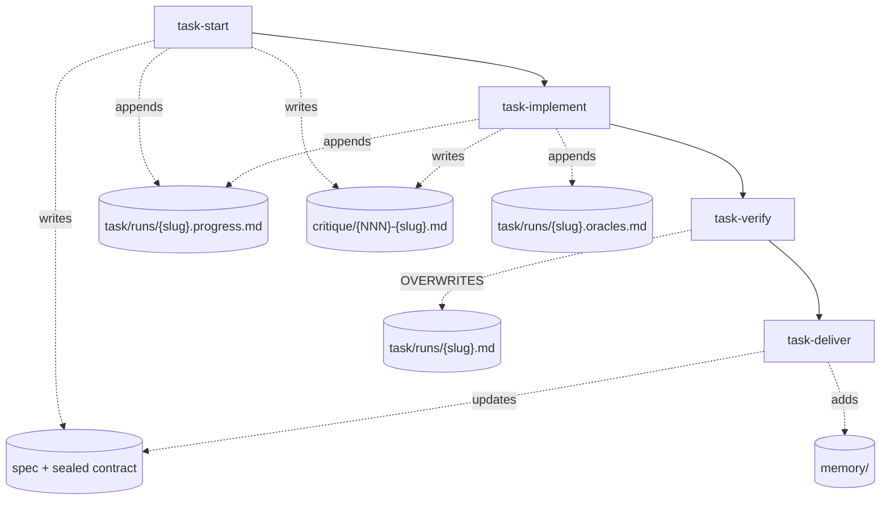

# Proposal: Task Workflow Metrics

| Field      | Value                                                                                                        |
| ---------- | ------------------------------------------------------------------------------------------------------------ |
| Status     | Proposed                                                                                                       |
| Date       | 2026-09-03                                                                                                     |
| Applies to | the `task-*` pipeline skills, the `verify` and `spec` tools, a new `.marvin/metrics/` location, and `.gitignore` |
| Principle  | Record only what is otherwise lost, and derive everything else from the artifacts already on disk               |
| Scope      | Quality of the delivered work and the active time the pipeline spends. Cost and token consumption are out of scope |

## Motivation

ADR-0042 shows both why measurement pays and why measuring once is not enough. An instrumented run
of a single feature task found that 67% of the pipeline's wall clock sat inside the two critic
agents, and that 97% of that time went into generating their reports rather than investigating.
That finding reversed a shipped design decision and bounded two loops, which is a good return on
one measurement. It was also obtained by reading a session transcript by hand, it covers one task,
and it cannot be repeated cheaply or compared against the next run.

The quality half has no equivalent at all. The sibling proposal
`docs/proposals/task-workflow-latency-optimization.md` opens by asserting that quality "is already
satisfactory in real-task testing" and then changes the pipeline on that basis. The assertion may
well be true, but no artifact in the repository can confirm it, and no later change can be checked
against it.

This proposal turns both halves into a standing series. Each delivered task records what it cost
and what it produced, so that the two questions you actually want to answer become queries rather
than one-off investigations:

- Where does the time in a task go, and which phase repays an investment in it?
- Which parts of the pipeline catch defects, and which ship them onward?

The design principle is stated once and applied throughout. Most of what you want to measure is
already written to disk by the existing pipeline, so the work is to close a small number of
genuine gaps and to derive the rest at delivery time, rather than to build a second telemetry
system beside the one that already exists.

## What the pipeline already records

Four phases write six kinds of typed record between them. The diagram shows which phase writes
which artifact, and it also shows the one place where information is destroyed.



Each record already carries structured fields rather than prose:

- The spec's frontmatter states the declared `type`, `risk`, `breaking` and `spike_required`
  flags, the creation date, and the sealed `contract_sha`. Its contract block states the files the
  task intends to touch and the acceptance criteria with their typed oracles.
- The progress journal appends one `spec-progress` block per step, each carrying a timestamp, the
  writing skill, the step identifier, and the seal in force at that moment.
- The critique receipt carries a `critic-verdict` block with two judged axes, each reporting a
  verdict alongside its blocker and warning counts.
- The oracle journal appends one `oracle-run` block per criterion, recording the outcome, the
  duration, the resolution rung that produced the command, and the tree it ran against.
- The verification run carries a `verify-result` block with the verdict, the outcome and duration
  of every quality gate, the wall-clock and summed-gate durations, and the provenance of the tree
  it proved.

The infrastructure for measurement is therefore already standing. What follows adds to it
sparingly.

## The finding: the records exist, the coverage does not

Measuring the repository's own corpus shows that the records are written far less often than the
architecture allows:

```
specs                 35   (33 shipped, 1 ready, 1 in-progress)
progress journals      1
oracle journals        6
verification runs      1
critique receipts      2
lessons               26
```

Three causes account for the gap, and each needs a different remedy.

The first is that recording is optional. The `verify` tool writes a per-spec run only when the
caller passes `specSlug`, and the skill prose asks for it rather than requiring it. A run without
a slug leaves no per-spec evidence at all.

The second is that several record types are recent. The progress journal, the oracle journal and
the critique receipt all postdate most of the shipped corpus, so their absence on older specs is
expected and permanent.

The third is that one record is destroyed by design. Every verification run overwrites
`task/runs/<slug>.md`, so only the final attempt survives. No aggregation can recover how many
attempts preceded it.

The practical consequence is that metrics computed today would be almost empty, and that
retroactive analysis of the 33 delivered specs is not available. The series starts when the
recording becomes reliable, which makes the ordering of the work packages below significant.

## Storage design

### Location

Metrics live in `.marvin/metrics/`, a new sibling of the existing per-group directories. This
follows the convention ADR-0007 already states, which gives each command group its own
subdirectory under `.marvin/`.

Placing metrics outside `.marvin/task/` also avoids a structural hazard. Three enumerators read
the top level of that directory with a non-recursive scan for Markdown files, so any new file
there is read as a spec. A separate directory is invisible to them by location, without needing
the nesting argument that keeps the `runs/` family safe.

The path is overridable through `MARVIN_METRICS_DIR`, matching the eight locations that already
support an override and keeping the storage module testable against temporary fixtures.

### Version control

A metrics series that is not committed does not survive the task that produced it. The current
`.gitignore` excludes `.marvin/*` with a single negation for `.marvin/memory/`, and the comment
beside that negation records exactly the failure this proposal would otherwise repeat: a lesson
"had to be hand-rescued from a worktree before it was lost with it."

The pipeline runs in a worktree. The spec is authored there, the implementation happens there,
the pull request is opened from there, and the worktree is removed once the branch merges. A
metrics file written into that worktree disappears with it.

The proposal is therefore to add a second negation:

```gitignore
.marvin/*
!.marvin/memory/
!.marvin/metrics/
```

The argument is the one ADR-0021 makes for lessons. A record of this kind earns its value by
accumulating, so it has to reach a clone. Committing also produces a useful side effect: the
metrics record for a task arrives on `dev` in the same pull request as the task itself, so the
series grows precisely when work is accepted.

Keeping metrics local is a defensible alternative, but it narrows what they can answer. The
series would then describe one machine and whichever worktrees remain open, and the outcome
metrics in particular would lose their meaning.

### File layout

Each task gets one file, `.marvin/metrics/<NNN>-<slug>.md`, numbered in creation order and named
for the spec's slug. This matches `.marvin/critique/` and `.marvin/handoff/`.

A single append-only series file such as `metrics.jsonl` would follow the `.marvin/usage/`
pattern, and it should be rejected here for one reason: the usage log is never versioned, whereas
this record is. Two branches that each append a line to the end of the same file conflict on
merge, and parallel branches are routine in this repository. One file per task never conflicts,
reads well in a diff, and costs nothing to aggregate at this scale.

### What is written live, and what is derived

The counters that matter most are the ones that exist only inside a running session. Fix-cycle
rounds, spec gaps and deferred items are tracked in `TodoWrite` and in the session's own context,
both of which context compaction destroys. This is the same problem the progress journal was
built to solve, and it needs the same answer.

**Appended during the run**, as one `task-metric` block per event, because the information is
otherwise lost:

- a fix-cycle round spent, naming which of the three loops consumed it;
- a spec gap recorded under the SPEC GAP protocol;
- an item classified as deferred or blocked when a loop reaches its budget;
- a critic verdict returned, with its pass number;
- a verification run completed, with its verdict.

**Derived at delivery**, as one terminal `task-metrics` block, because the information already
exists elsewhere and a copy would only be able to disagree with it:

- the contract's size and oracle strength, read from the spec;
- the number of reseals, counted as the distinct `contract_sha` values in the progress journal;
- the phase boundaries, taken from the progress journal's timestamps;
- the gate outcomes and durations, read from the `verify-result` block;
- the red-green state, read from the oracle journal;
- the blocker and warning counts, read from the critique receipt;
- the scope drift, computed from the branch diff against the contract's file list.

The terminal block also records which of these sources were present. A task that ran without a
per-spec verification run should appear in the series as a measured gap rather than as a silent
absence.

### Boundary with the progress journal

Two journals sitting beside each other need an explicit division, or they converge into one.

The progress journal answers where the work stopped. It carries free-form prose in its `detail`
field and its reader is a human, or a session resuming after an interruption. The metrics journal
answers what the work cost. It carries typed counters and its reader is the aggregator. The
metrics journal does not copy timestamps; it reads them from the progress journal when the
roll-up is computed.

### Metrics are not a sixth report group

`ReportGroup` is a closed enumeration of five values, and `test/report-groups.test.mjs` derives
the set from the contract and asserts it against every code enumeration and twelve pinned prose
sites. A sixth value costs those twelve edits and a standing obligation to keep them aligned.

There is nothing to buy with that. A metrics record is a data series rather than a document of
findings, and the precedent already exists: `.marvin/report/` sits beside the five groups, holds
the tool's own state, and is never enumerated by the viewer. The reading surface for metrics is
an aggregation action and a line in `dashboard`, which already summarises the state of the whole
toolbox.

## The metric set

The set is organised by the two axes in scope. A third group sits across both, and that group is
the interesting one.

### Time: how long the work took

| Identifier | Metric                                                            | Source                     |
| ---------- | ----------------------------------------------------------------- | -------------------------- |
| T1         | Intake duration, from step 1.5 to step 9F                          | progress journal           |
| T2         | Implementation duration, from step 2.5 to the last criterion       | progress journal           |
| T3         | Time to the first green verification                               | verification-run journal   |
| T4         | Active pipeline time, the sum of T1, T2 and T3                     | derived                    |
| T5         | Gate concurrency efficiency, `wallClockMs` over `sumOfGatesMs`     | `verify-result`            |
| T6         | Oracle duration per criterion                                      | oracle journal             |
| T7         | Duration of each quality gate                                      | `verify-result`            |
| T8         | Time spent inside critic dispatches, per dispatch and in total     | metrics journal (new)      |

T4 replaces the calendar span between the spec's `created` date and its delivery date. That span
measures when you were at the keyboard, so improving it says nothing about the pipeline.

### Quality: what the work produced

| Identifier | Metric                                                                          | Source                |
| ---------- | -------------------------------------------------------------------------------- | --------------------- |
| Q1         | Scope drift, the files changed that the contract's `files[]` did not declare       | git diff and contract |
| Q2         | Oracle strength, the share of criteria with an executable proof rather than prose  | contract              |
| Q3         | Red-green completeness on bugfixes, the share of criteria with both a red and a green run | oracle journal |
| Q4         | Share of quality gates recorded as `not-run`                                       | `verify-result`       |
| Q5         | Freshness waivers taken through `allowStale`                                       | `verify-result`       |
| Q6         | Critic blockers and warnings, by the compliance and quality axes                   | `critic-verdict`      |
| Q7         | Spec gaps recorded per task                                                        | metrics journal (new) |
| Q8         | Items deferred or blocked when a loop reached its budget                           | metrics journal (new) |
| Q9         | Whether the Definition-of-Ready gate passed on the first call                      | step 7F, to structure |
| Q10        | Oracle resolution rung, and the share that resolved to nothing                     | oracle journal        |
| Q11        | Review-fix commits pushed after the pull request opened                            | git                   |
| Q12        | Escaped defects, a later task whose cause names files an earlier spec touched      | spec corpus           |

Q7 is the single most valuable addition in the set. It counts the times the spec failed to cover
the reality the implementation met, which is direct feedback from the second phase to the first,
and today it survives only as prose in a pull request body.

### Rework: where the two axes meet

| Identifier | Metric                                                          | Source                     |
| ---------- | ----------------------------------------------------------------- | -------------------------- |
| R1         | Reseals, the distinct `contract_sha` values recorded for the spec  | progress journal           |
| R2         | Critic passes before a terminal verdict                            | receipt, add a pass number  |
| R3         | Fix-cycle rounds spent, reported per loop                          | metrics journal (new)      |
| R4         | Verification runs before the first PASS                            | verification-run journal   |

## Why the axes have to be read together

Time and quality are exchangeable in this pipeline, and either one optimised alone degrades into
nonsense. Four pairings carry that tension, and each should be read as a pair.

**T1 against Q7.** Intake time buys specification completeness. Cutting T1 shows up as spec gaps
during implementation rather than as a change in T1 itself.

**R2 against Q6.** ADR-0042 bounded the spec-critic loop to two dispatches, so R2 no longer asks
how far the loop ran. It asks how often the bound is reached and whether the second dispatch earns
its cost, which the blocker count between the two passes answers. A bound that is reached on most
tasks means the loop was bounded in the wrong place; one that is rarely reached means it is
correctly placed and the metric confirms it.

**T8 against R2.** The same measurement showed that critic time dominates the pipeline, so the
cost of a dispatch is the item worth watching over the series. T8 is the metric ADR-0042 had to
obtain by hand.

**T2 against Q1.** A fast implementation that drifts out of scope has moved work into review and
into the next task rather than saving it, and Q11 shows where it moved.

One requirement follows for the terminal block. It writes both axes on every task, including
where one of them is empty, because a task recording time without quality is worse than an absent
one: it looks measured.

## Deliberately excluded

Three candidates were considered and left out.

Cost and token consumption are out of scope by direction, and they are also not observable. The
usage middleware records the timestamp, the kind, and the registered name of each invocation, and
deliberately nothing else, so the server never sees the model's consumption.

Lessons captured per task counts whether the feedback loop was closed rather than whether the
work was good or fast. It belongs in `dashboard` as process hygiene.

The interval from opening a pull request to merging it measures human review latency rather than
the pipeline. It remains useful as context alongside the series, but not as a metric within it.

## Work packages

Follow the standing ground rules for this repository. Branch off `dev`, open every pull request
into `dev`, rebuild `dist/server.js` in a checkout with its own installed `node_modules`, bump the
version with `npm run sync-version`, and add a `CHANGELOG.md` entry for each bump.

**WP1 — Commit the location.** Add the `.marvin/metrics/` negation to `.gitignore` and add the row
to the working-directory table in `CLAUDE.md`. Size XS. This lands first because every later
package writes records that would otherwise be discarded.

**WP2 — Storage and the live journal.** Add `storage/metrics.ts` with an append that never reads
the file back and a read that drops an unparseable block rather than the file, following
`storage/progress.ts`. Add `MARVIN_METRICS_DIR` to `lib/env.ts` and the `TaskMetrics` contract to
the shared contracts package. Wire the five live events into the `task-implement` prose. Size M.

**WP3 — The roll-up at delivery.** Compute the derived fields from the spec, the progress journal,
the oracle journal, the `verify-result` block and the critique receipt, and write the terminal
block from `task-deliver`. Record which sources were available. Size M.

**WP4 — The verification-run journal.** Append one entry per run to
`task/runs/<slug>.verify.md`, following the oracle journal. The full artifact
`task/runs/<slug>.md` stays the latest run, so the delivery gate is unchanged. This unlocks T3
and R4. Size S.

**WP5 — The aggregation surface.** Add a `metrics` action that reads the series and reports the
three groups, and add a line to `dashboard`. Size M.

Land WP1 first, then WP2 and WP3 together, since they capture the volatile counters and everything
else can be derived later from the same files. WP4 and WP5 follow in either order.

An ADR should accompany WP1 and WP2, since the change adds a `.marvin/` location and a record
type. It would take the next free number, 0043, and ADR-0007's working-directory table needs the
new row either way.

## Open questions

1. Should the metrics directory be committed, as proposed, or kept local? The rest of the design
   holds either way, but the outcome metrics Q11 and Q12 lose most of their value if the series
   does not reach a clone.
2. Should a verification run without a `specSlug` warn, so that the coverage gap is visible at the
   moment it happens rather than only in the roll-up?
3. Should WP4 land before WP2, so that T3 and R4 are present from the first recorded task rather
   than being permanently absent for the earliest entries in the series?
