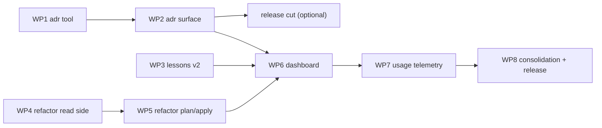

# Proposal: Toolbox Expansion — ADR lifecycle, Lessons v2, Refactoring family, Dashboard

| Field      | Value                                                                                                    |
| ---------- | -------------------------------------------------------------------------------------------------------- |
| Status     | **Proposed** — awaiting work-package execution; living record in [toolbox-expansion-progress.md](./toolbox-expansion-progress.md) |
| Date       | 2026-07-02                                                                                                 |
| Applies to | new `adr-*` and `refactor-*` prompt groups; `lessons` / new `adr` / new `dashboard` MCP tools; shared contracts; `runPackServer`; two new working-dir conventions (`.marvin/refactor/`, `.marvin/usage/`) |
| Origin     | Maintainer request (2026-07-02): make marvin a *complete* toolbox — full ADR lifecycle, a lessons-learned mechanism, a refactoring block, and a toolbox-usage dashboard |
| Related    | [ADR-0002](../adr/0002-tool-backed-verification.md), [ADR-0007](../adr/0007-marvin-working-directory.md), [ADR-0010](../adr/0010-tool-backed-contract-seal.md), [ADR-0021](../adr/0021-lessons-feedback-loop.md), [ADR-0024](../adr/0024-mcp-apps-widget-architecture.md), [ADR-0026](../adr/0026-configurable-status-model.md); planned ADR-0027 … ADR-0030 |

## Motivation

The maintainer named four capability blocks that separate marvin-as-shipped from
marvin-as-toolbox. An inventory of the current surface shows they are in very different
states of existence — the plan below re-scopes each block against what is already built:

1. **ADR block — exists as create-only.** The single `adr` skill drafts a well-formed record
   interactively, but the whole *lifecycle* around it is missing: no ratification step, no
   supersession mechanics, no corpus lint, no coverage analysis, no CLAUDE.md sync. Every
   deterministic guarantee (next number, index regeneration, paired supersede links, status
   stamps) currently depends on prose instructions the model may or may not follow — exactly
   the failure mode [ADR-0002](../adr/0002-tool-backed-verification.md)/[ADR-0010](../adr/0010-tool-backed-contract-seal.md)
   call "determinism by name".
2. **Lessons-learned — already shipped.** [ADR-0021](../adr/0021-lessons-feedback-loop.md)
   delivered the `.marvin/memory/` store and the `lessons` tool (`add | search`), with capture
   at two points (`marvin-debugger` reflect, `task-deliver` retrospective) and recall at one
   (`task-start` intake). This block is therefore **gap closure, not creation**: recall is
   too narrow (implementation and fix flows never look back), capture misses the PR-review
   channel, the store has no hygiene surface (stats, prune, dedup), no human browse command,
   and the code-writing agents are not wired to consult it.
3. **Refactoring block — does not exist.** The nearest instruments are `migration-plan`
   (large structural moves) and the `sec-*` family (the proven shape for a scanner group).
   There is no project audit, no smell/pattern analysis, no findings-to-plan-to-execution
   path.
4. **Dashboard — data layer half-built.** The `DashboardState` contract already exists
   (ADR-0024 stage 1) and the `help` tool already computes its kanban/config/git subset, but
   nothing renders a toolbox-wide report, artifact inventories (specs, security reports,
   lessons, handoffs, ADRs) are never aggregated, and there is no usage signal at all.

The reference model for block 1 is the maintainer's ADR machinery from another project: six
skills and two guided commands over one deterministic script, with read-only and mutating
paths strictly separated and three actions reserved for humans. This plan adapts that shape
to marvin doctrine: the script becomes an **MCP tool** (TypeScript, zod-validated, bundled),
the skills stay prose, and the human gates use `disable-model-invocation` frontmatter.

## Design decisions

Four decisions anchor the plan. Each gets its own ADR when the corresponding work package
lands (the kanban-rework precedent).

### D1 — ADR lifecycle mechanics move to a deterministic `adr` tool (planned ADR-0027)

A new `adr` MCP tool owns everything a script can guarantee: `next` (number + target path),
`list` (parsed corpus with statuses), `index` (regenerate the corpus index between managed
markers), `audit` (corpus lint: dangling `NNNN` references, numbering holes/duplicates,
broken supersede pairs, placeholder residue, invalid status, stale index), `accept`
(readiness gate — no placeholders, required sections present, links resolve — then status +
date stamp), and `supersede` (new record linked both ways; the old record's *status* flips,
its content is never edited).

The corpus is **host-adaptive**, like spec locations (ADR-0005): directory resolution is
`.marvin/config.json` → existing `docs/adr/` / `docs/decisions/` / `adr/` → default
`docs/adr/`; the parser tolerates both header styles found in the wild (marvin's own
table-style `| Status | ... |` and MADR's `## Status` heading); the status vocabulary is the
closed set `proposed | accepted | deprecated | superseded | rejected`.

Authority moves to the gates, not the draft: **creation becomes model-invocable** (the
current `disable-model-invocation` on the `adr` skill is dropped) but a tool-created or
skill-drafted record always lands as `proposed`. Ratification (`adr-accept`), rollback
(`adr-supersede`), and project-memory sync (`adr-sync`) are human-only.

An `AdrRecord` zod schema joins the shared contracts (ADR-0024 data-first staging), feeding
the dashboard and the future widget family.

### D2 — Lessons v2: wider loop, hygiene surface (planned ADR-0028)

The store and tool stay as ADR-0021 built them (keyword search, no embeddings — the store is
small by design). The loop widens on both ends and gains maintenance:

- **Recall** expands from one point to four: `task-implement` pre-flight,
  `sec-fix` intake, `refactor-apply` pre-flight (arrives with D3), plus a search-first step
  in the code-writing agents (`marvin-tm-executor`, `marvin-tm-review-fixer`).
- **Capture** adds the PR-review channel: `task-fix-pr` records a lesson when reviewer
  feedback reveals a recurring pattern (same guards as `task-deliver` — routine feedback
  writes nothing).
- **Hygiene**: the tool gains `stats` (counts by type/tag — a dashboard feed) and `prune`
  (list stale candidates, delete by slug behind an explicit confirmation); `add` gains a
  near-duplicate guard (searches before writing, warns instead of double-writing).
- **Browse surface**: a `/marvin:lessons` prompt (thin tool wrapper, kanban-style) so humans
  can search, add, and prune without leaving chat.

### D3 — Refactoring family: read → plan → apply, with hard rails (planned ADR-0029)

A new `refactor-*` group, shaped like the `sec-*` family, split by mutation:

- **`refactor-audit`** (read-only) — whole-project structural audit: architecture map,
  hotspots (git churn × size), dependency tangles, dead-code candidates. Heavy reading is
  delegated to a new **`marvin-refactor-auditor`** agent (read-only `tools:` allowlist, like
  `marvin-auditor`). Output: a numbered findings register (`F1…Fn`, severity + effort) in
  `.marvin/refactor/NNN-audit-<slug>.md`.
- **`refactor-smells`** (read-only) — scoped scan of a path, module, or diff: code smells,
  anti-patterns, idiom/naming inconsistencies. Same register format, composable with the
  audit.
- **`refactor-plan`** — turns selected findings into a sequenced, risk-annotated plan
  (`.marvin/refactor/NNN-plan-<slug>.md`). Large items are explicitly handed to the task
  pipeline (`task-start` produces the spec); the plan is the bridge, not a rival pipeline.
- **`refactor-apply`** — executes exactly one small, behavior-preserving step at a time:
  requires green `verify` before starting, re-runs `verify` after, refuses when the touched
  code has no test coverage (offers to write the pin-down test first). Consults lessons
  before, captures a lesson after when warranted.

Findings can be filed to the kanban board as chores via the existing `task` tool — the audit
ends by offering exactly that. `.marvin/refactor/` joins the ADR-0007 working-directory
table. A `RefactorFinding` contract joins the shared schemas (dashboard + future widget).

### D4 — Dashboard is data-first; usage telemetry is a local self-ignoring log (planned ADR-0030)

A new `dashboard` MCP tool aggregates the whole toolbox state and renders a sectioned
terminal report, returning the same data as `structuredContent` conforming to an **extended
`DashboardState`** (adds ADR corpus counts by status, refactor/security report inventories
with ages, lessons stats, usage summary). Sources: the `help` tool's existing
kanban/config/git computation, artifact scans over `.marvin/*`, and the `adr` tool's corpus
parser. Surfaced as `/marvin:dashboard`. Missing directories degrade to zeros — the report
works on a fresh project.

Usage telemetry answers "which commands does this project actually use": `runPackServer`
gains a middleware hook that appends one JSONL event per prompt-get and tool-call to
`.marvin/usage/events.jsonl`. The directory is **self-ignoring** (marvin writes
`.marvin/usage/.gitignore` containing `*`) so per-machine noise never reaches the repo; the
log is size-capped with rotation; `usage: { enabled: false }` in `.marvin/config.json` turns
it off. The dashboard renders top commands / last-used from whatever log exists.

The MCP Apps **widget itself stays out of scope** — this decision finishes the widget's data
layer per ADR-0024's data-first staging; the widget stage consumes these contracts later.

## Versioning and release strategy

Plugin is at 0.6.0. Every work package that adds prompts, tools, or agents is a **minor**
bump per policy (WP1 → 0.7.0 … WP7 → 0.13.0); WP8 is a docs/consolidation sweep (patch only
if code moves). Recommended release cuts: **after WP2** (the ADR family is independently
useful) and **after WP8** (the full toolbox) — each a `dev → main` promotion PR merged **with
a merge commit** (the v0.6.0 precedent: histories must stay joined) followed by a `vX.Y.Z`
tag on `main` (ADR-0014).

## Work packages

Ordered by dependency, one topic branch and one PR into `dev` each (ADR-0019), each with its
own tests. WP3 (lessons) and WP4–WP5 (refactor) are independent of the ADR track and of each
other — they can reorder if convenient; WP6 wants WP3 and WP5 landed first (it consumes
`lessons stats` and refactor inventories), WP7 builds on WP6, WP8 is last.

### WP1 — `adr` MCP tool and contract

**Goal:** every deterministic ADR guarantee lives in a tool; the corpus is parseable in both
header styles. Implements the mechanics half of D1.

Scope:

- `storage/adr.ts` (or `lib/`): corpus discovery (config → detection → default), tolerant
  record parser (table-style and heading-style headers; number, slug, title, status, date,
  supersedes/superseded-by links), status vocabulary.
- `tools/adr.ts`: actions `next | list | index | audit | accept | supersede` as defined in
  D1; `accept`/`supersede` are the mutating pair and validate fail-closed; `index`
  regenerates the corpus index between managed markers (marker-based so hand-written prose
  around it survives).
- `adr` block in `.marvin/config.json` (optional `dir`, optional `index_file`) — read via the
  same fail-closed config path the kanban tools use; foreign keys survive read-modify-write.
- `AdrRecord` schema in `packages/marvin-mcp-shared/src/contracts/adr.ts`, exported from the
  contracts index; tool returns `structuredContent` built from it.
- Unit tests over fixtures in **both** header styles (including marvin's own corpus shape)
  plus e2e over the stdio driver; audit fixtures for each lint class.
- ADR-0027 authored and linked from both README indexes (docs-drift guard).
- Version 0.7.0 (plugin manifest, marketplace manifest, server package). Rebuild `dist/`.

### WP2 — ADR command surface

**Goal:** the full lifecycle is reachable through all three doors; human gates enforced.
Implements the surface half of D1.

Scope:

- Rework `skills/adr/SKILL.md`: creation drafts via dialogue as today but delegates
  numbering/path/index to the `adr` tool; drop `disable-model-invocation` (drafts always land
  `proposed`).
- New skills + matching `commands/*.md`, each thin and tool-backed where a tool action
  exists: `adr-review` (deep single-record review against the template, auto-fix of formal
  defects, verdict `READY_FOR_ACCEPTANCE` — never sets `accepted`), `adr-accept` 👤,
  `adr-audit` (read-only corpus lint — renders `adr audit` output with remediation),
  `adr-coverage` (read-only gap analysis: recorded decisions vs. the actual stack, ranked
  candidates), `adr-supersede` 👤, `adr-sync` 👤 (regenerates a marker-managed
  architecture-decisions block in CLAUDE.md from **accepted** records only; always shows the
  diff before writing).
- `disable-model-invocation: true` on `adr-accept`, `adr-supersede`, `adr-sync`.
- Six new prompt registry entries (42 → 48), `skill:`-backed.
- Docs: `docs/commands.md` rows + total count, plugin README, CLAUDE.md command table.
- Version 0.8.0; dist rebuild.

### WP3 — Lessons v2

**Goal:** the feedback loop reaches every write-path and gains a maintenance surface.
Implements D2 (planned ADR-0028).

Scope:

- `lessons` tool: `stats` and `prune` actions; near-duplicate guard on `add`
  (search-before-write, warn on match); storage support as needed.
- New `/marvin:lessons` prompt — inline `body:` thin wrapper (kanban-style), search / add /
  stats / prune from chat (48 → 49 prompts).
- Recall wiring: `task-implement` pre-flight step, `sec-fix` intake step; search-first
  instructions in `marvin-tm-executor` and `marvin-tm-review-fixer`.
- Capture wiring: `task-fix-pr` retrospective step with the anti-boilerplate guards.
- Tests: new actions unit + e2e; dedup guard cases.
- ADR-0028 authored + linked; version 0.9.0; dist rebuild.

### WP4 — Refactoring read side

**Goal:** the project can be audited and scanned without any mutation. Implements the
read-only half of D3 (planned ADR-0029).

Scope:

- Skills + commands + prompts: `refactor-audit`, `refactor-smells` (49 → 51).
- Agent `agents/marvin-refactor-auditor.md` with a read-only `tools:` allowlist
  (Read, Glob, Grep, Bash).
- `.marvin/refactor/` convention: numeric-prefixed reports, findings register format
  (`F<n>` id, severity, effort, evidence, suggested direction) — documented in the skill and
  in the ADR-0007 cross-reference table (CLAUDE.md + architecture docs).
- Audit closes by offering to file selected findings as kanban chores via the `task` tool.
- `RefactorFinding` contract in shared contracts.
- ADR-0029 authored + linked (covers the whole family including WP5's plan/apply design);
  version 0.10.0; dist rebuild.

### WP5 — Refactoring plan and apply

**Goal:** findings become sequenced plans; small steps execute under hard rails. Completes D3.

Scope:

- Skills + commands + prompts: `refactor-plan`, `refactor-apply` (51 → 53).
- `refactor-plan`: consumes findings registers, produces `.marvin/refactor/NNN-plan-<slug>.md`
  with sequencing, risk, rollback; items above a size threshold are routed to `task-start`.
- `refactor-apply`: one finding at a time; `verify` green required before and after
  (config-first gate resolution, ADR-0009); refuses on uncovered code — offers the pin-down
  test first; lessons search before / capture after.
- Docs rows; version 0.11.0; dist rebuild.

### WP6 — Dashboard

**Goal:** one command shows the whole toolbox state in the terminal, and the widget's data
contract is final. Implements the report half of D4 (planned ADR-0030).

Scope:

- `tools/dashboard.ts`: aggregators for kanban/config/git (reuse the `help` computation),
  artifact inventories (`.marvin/task/` specs + `verification.md` freshness,
  `.marvin/security/` reports + age, `.marvin/refactor/`, `.marvin/handoff/`), `lessons
  stats`, ADR corpus by status (via WP1 parser), usage summary when a log exists (WP7).
- `DashboardState` contract extension (adr / security / refactor / usage sections);
  `structuredContent` emitted alongside the text report.
- Sectioned terminal text renderer; zero-state degradation on fresh projects.
- New `dashboard` prompt — inline `body:` wrapper (53 → 54).
- Tests: aggregation unit tests over fixtures, e2e, empty-project case.
- ADR-0030 authored + linked (includes the D4 usage-log decision); version 0.12.0; dist rebuild.

### WP7 — Usage telemetry

**Goal:** the dashboard can answer "what does this project actually use". Completes D4.

Scope:

- `runPackServer` middleware hook in `packages/marvin-mcp-shared`: one JSONL event per
  prompt-get and tool-call (`ts`, `kind`, `name`) appended to `.marvin/usage/events.jsonl`.
- Self-ignoring directory (`.marvin/usage/.gitignore` = `*`), size cap + rotation,
  `usage.enabled` kill-switch in `.marvin/config.json` (fail-open to enabled; errors in the
  logger must never break a tool call).
- Dashboard usage section: top commands, last-used, event count and window.
- Docs: privacy note (local-only, never committed, how to disable).
- Tests: events written on tool call, kill-switch respected, rotation.
- Version 0.13.0; dist rebuild.

### WP8 — Consolidation and release

**Goal:** the toolbox reads as one coherent product; a release ships.

Scope:

- Full docs sweep: `docs/commands.md` final table and count, `docs/architecture.md` (groups,
  three-doors counts, working-dir table), plugin README, root README, CLAUDE.md.
- `npm run lint:docs`, `lint:manifests`, `verify-dist`, `smoke`, full test run, coverage look.
- CHANGELOG roll-up for the 0.7.0 → 0.13.0 line.
- Promotion PR `dev → main` merged with a **merge commit**, tag, GitHub Release via
  `release.yml`.

## Session execution protocol

Each work package runs in its **own session**, kanban-rework style:

1. **Kickoff** — read this proposal and the [progress record](./toolbox-expansion-progress.md);
   read the WP's planned/authored ADRs; start from a fresh `dev`.
2. **Branch** — `feat/toolbox-wp<N>-<slug>` (`docs/` prefix for WP8 if it stays docs-only).
3. **ADR first** — when the WP introduces one, author it before the code that relies on it.
4. **Gates before PR** — `npm run build`, `npm test`, `lint:manifests`, `verify-dist`,
   `lint:docs`, `smoke`. Known trap: lint-staged reformats source *after* the build — rebuild
   `dist/` and amend if the guard fails.
5. **Tracker in the same PR** — update the progress status board row, tick the checklist,
   add a dated log entry.
6. **One PR into `dev`**, never direct commits; the next WP session starts after merge.

## Non-goals / deferred

- **MCP Apps widgets** (ADR-0024 stage 2) — this plan completes their data layer
  (`AdrRecord`, `RefactorFinding`, extended `DashboardState`); the widget stage follows.
- **Tracker connectors** (Jira/ADO/YouTrack) — unchanged deferral from the kanban rework.
- **Semantic lesson search** — keyword search stays; the store is small by design (ADR-0021).
- **Automated codemods** — `refactor-apply` is model-executed under verify rails, not an AST
  rewriter.
- **Cross-project lessons** — the store stays per-repo, team-shared via git.

## Appendix A — target command surface

New rows only; the registry grows 42 → **54** prompts, 7 → **9** tools, 9 → **10** agents.

| Command | Kind | Mutates | Gate |
| ------- | ---- | ------- | ---- |
| `/marvin:adr` (rework) | skill + tool-backed create | writes new record (`proposed`) | model or human |
| `/marvin:adr-review` | skill | edits one `proposed` record (formal fixes only) | model or human |
| `/marvin:adr-accept` | skill + `adr accept` | status flip + date stamp | **human only** |
| `/marvin:adr-audit` | skill + `adr audit` | no | model or human |
| `/marvin:adr-coverage` | skill | no | model or human |
| `/marvin:adr-supersede` | skill + `adr supersede` | new record + paired link flip | **human only** |
| `/marvin:adr-sync` | skill + `adr list` | CLAUDE.md managed block (diff-first) | **human only** |
| `/marvin:lessons` | inline prompt → `lessons` tool | add/prune only | model or human |
| `/marvin:refactor-audit` | skill + agent | no (report file only) | model or human |
| `/marvin:refactor-smells` | skill | no (report file only) | model or human |
| `/marvin:refactor-plan` | skill | plan file only | model or human |
| `/marvin:refactor-apply` | skill + `verify` | source code, verify-gated | model or human |
| `/marvin:dashboard` | inline prompt → `dashboard` tool | no | model or human |
