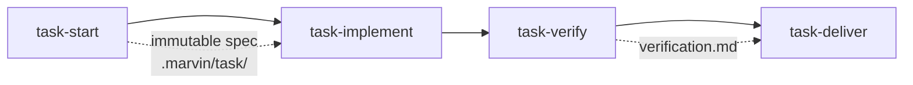

# Usage guide

This guide collects the workflows you will reach for day to day, each written as a
self-contained set of steps. It assumes you have already installed the plugin and run a
Marvin command once; if not, start with the [getting-started guide](./getting-started.md).

Each section below is a task. Read the one that matches what you are trying to do rather
than working through the page top to bottom.

## Commit and open a pull request

Marvin splits shipping a change into two commands that hand off to each other.

Start by committing your work:

```text
/marvin:commit
```

The command stages changes intentionally, checks for sensitive files, drafts a
Conventional Commits message, and commits only after you confirm. When the branch
belongs to a kanban task, it adds a `Refs:` footer linking the task.

Then open the pull request:

```text
/marvin:pr-create
```

This runs pre-flight checks, writes a structured description with a verification
checklist, links any referenced issue, and captures the resulting PR URL back onto the
kanban task when there is one. From there the rest of the pull-request family takes
over: `/marvin:pr-review` posts a review with severity-tagged inline comments,
`/marvin:pr-resolve` works through unresolved threads, and `/marvin:pr-merge` merges and
returns you to the base branch.

## Run the spec-driven task pipeline

Use the task pipeline for a change substantial enough to deserve a written spec before
any code is touched. It separates the decisions a human should make from the execution
that follows, and each stage gates the next.



The stages run in order:

1. **`/marvin:task-start`** co-creates a spec through a structured dialogue — grounding
   in the codebase, acceptance criteria bound to their proofs, a red-team critic, and a
   tool-backed Definition-of-Ready gate. The result is an immutable spec under
   `.marvin/task/`.
2. **`/marvin:task-implement`** executes that spec in the current session and self-tests
   as it goes.
3. **`/marvin:task-verify`** runs the quality gates — tests, lint, type-check, and build
   — concurrently, detecting the stack automatically, and writes `verification.md`.
4. **`/marvin:task-deliver`** commits and opens the pull request, and refuses to proceed
   if verification did not pass.

Reach for this pipeline when the work benefits from an explicit contract and a
verifiable finish. For quick day-to-day changes, the kanban board and a direct
commit are lighter.

## Track work on the kanban board

The board is a per-project tracker stored as markdown under `.marvin/kanban/`. Create a
task with the command for its type — `/marvin:kanban-bug`, `/marvin:kanban-feature`,
`/marvin:kanban-chore`, or `/marvin:kanban-spike`:

```text
/marvin:kanban-bug
```

Move a task through its lifecycle with `/marvin:kanban-start` (which branches off and
marks it in progress), `/marvin:kanban-review`, and `/marvin:kanban-done`. See the whole
board grouped by status with `/marvin:kanban-list`, inspect one task with
`/marvin:kanban-show`, and check what you are currently working on with
`/marvin:kanban-status`.

The board adapts to your team's workflow rather than imposing a fixed one. Configure the
status vocabulary and a tracker link template through `/marvin:kanban-config`; the
[configuration reference](./configuration.md) documents every setting.

## Audit the codebase for security issues

For a comprehensive review aligned with the OWASP Top 10, run:

```text
/marvin:sec-scan
```

This orchestrates the focused scanners — secrets, dependencies, and infrastructure —
and adds deep static analysis, writing its findings under `.marvin/security/`. When you
only need to check what you are about to commit, `/marvin:sec-gate` is the fast,
diff-scoped alternative that fits a pre-commit moment.

The focused scanners also stand alone when you know what you are looking for:
`/marvin:sec-secrets` for leaked credentials across code and git history,
`/marvin:sec-deps` for vulnerable or unmaintained packages, and `/marvin:sec-iac` for
Terraform, Kubernetes, and Docker. Once scans have run, `/marvin:sec-report` recovers
the structured findings they wrote and lists them by severity so you can triage.

## Refactor without breaking behavior

The refactoring family is deliberately split into read, plan, and apply stages so that
no code changes until you have reviewed the findings.

1. Survey the code first. `/marvin:refactor-audit` runs a whole-project structural
   audit, and `/marvin:refactor-smells` scans a single path or diff. Both write a
   numbered findings register under `.marvin/refactor/`.
2. Turn selected findings into an ordered plan with `/marvin:refactor-plan`, which
   annotates each step with its rationale, risk, and rollback, and routes anything
   spec-sized to `/marvin:task-start`.
3. Apply exactly one step with `/marvin:refactor-apply`. It requires the verify gate to
   be green before and after the change, refuses to touch uncovered code without a
   pin-down test first, and rolls back rather than debugging forward when a step goes
   red.

Because every apply step is behavior-preserving and independently verified, you can stop
after any step and still have a working tree.

## Record an architecture decision

When you make a decision with long-lived consequences, capture it as an Architecture
Decision Record:

```text
/marvin:adr
```

The `adr` tool assigns the next number, resolves the corpus location, and writes a draft
that always lands in the `proposed` state. From there `/marvin:adr-review` checks the
draft against the codebase, and a human ratifies it with `/marvin:adr-accept`.
Ratification, rollback (`/marvin:adr-supersede`), and syncing the accepted-decisions
digest into `CLAUDE.md` (`/marvin:adr-sync`) are reserved for people, not automated.

## See the whole toolbox at a glance

To review the state of everything Marvin tracks in a project — the board, artifact
inventories with freshness, the ADR corpus by status, lessons, and local usage — run:

```text
/marvin:dashboard
```

On a host that supports MCP Apps, the same command renders an interactive panel; on a
plain terminal it prints the equivalent text report.
